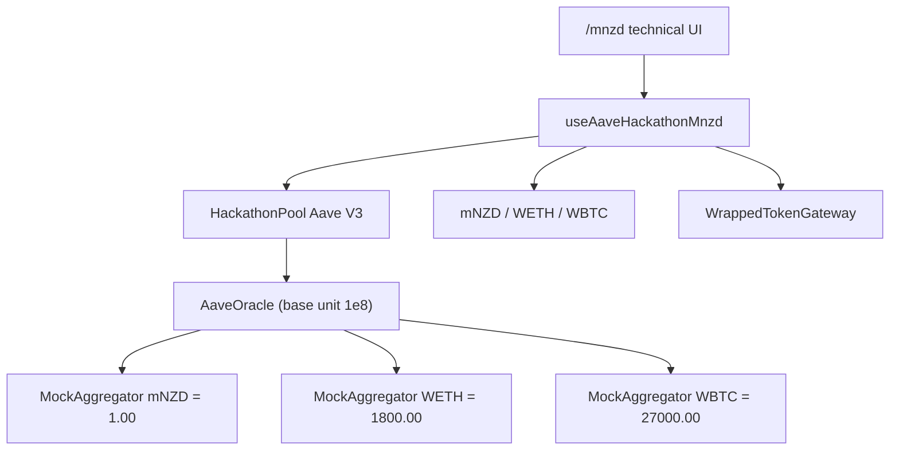

# WEB3NZ Hackathon — Build Plan (Source of Truth)

**Last reconciled with the repository + live Sepolia reads: 25 Jul 2026, block ~11,345,240.**

**Team:** frontend · contracts / market deploy
**Stack:** Scaffold-ETH 2 · Next.js / wagmi / RainbowKit · Aave V3 on Ethereum Sepolia
**Product routes:** `/mnzd` (primary multi-asset demo: WETH / WBTC / mNZD) · `/aave` (official EURS reference — **hidden from nav**)

> **Rule:** This file is the single source of truth for what we are building *now*. If the frontend/backend seam changes, update **§7 Frontend/backend interface** here first, then tell the other person in one Discord line.

### Evidence conventions used in this document

Every claim in this plan is tagged with one of:

| Tag | Meaning |
| :--- | :--- |
| **[Verified]** | Read directly from Sepolia on 25 Jul 2026, or read directly from committed source in this repo / `aave-v3-origin`. |
| **[Derived]** | Arithmetic or logic that follows deterministically from a **[Verified]** fact. Not itself read from chain. |
| **[Unverified]** | Plausible but not confirmed. Do not state as fact in the pitch. |
| **[Recommendation]** | A proposed action, not a statement of current reality. |

---

## 1. Project definition

### What we are building now

A **NZD-denominated savings & lending prototype** for New Zealand users, demonstrated on Ethereum Sepolia using **Aave V3**.

| Audience | Intended value |
| :--- | :--- |
| **Saver** | Supply NZD-denominated test liquidity and earn interest **when borrowing demand exists**. |
| **Borrower** | Lock crypto (ETH/WETH) as collateral and borrow NZD liquidity **without selling** the crypto. |

### What the repo and the deployed market actually support today

| Proposition | Status |
| :--- | :--- |
| NZD-*labelled* savings UX on a private Aave V3 market (**mNZD**) | **Done, end-to-end tested on Sepolia** — mint → approve → supply → withdraw (§10) |
| Same-asset borrow (**mNZD** against supplied **mNZD**) | **Done, end-to-end tested on Sepolia** — used as *protocol validation only*, not a consumer product (§3) |
| Same-asset borrow (**EURS** against **EURS**, official market) | **Implemented but untested** |
| **WETH reserve on the hackathon market** | **Done** — listed, active, collateral + borrow enabled **[Verified]** |
| **WETH/ETH collateral → borrow mNZD** | **Implemented but untested** — market config and UI exist; **zero WETH has ever been supplied** **[Verified]**; blocked on the oracle mispricing in §2 before the *pitch number* is defensible |
| Email login / embedded wallet / gas sponsorship | **Not implemented** (RainbowKit remains) |
| Real NewMoney dNZD / NZDD / zNZD | **Not used** — asset is **mNZD** (mock stand-in, 6 decimals) |
| Official Aave mainnet listing / governance-approved NZD market | **Not claimed** — private hackathon market + separate official Sepolia EURS path |

**Honest product framing for the remainder of the hackathon:**

- **Primary product path:** private Aave V3 hackathon market with **WETH, WBTC, mNZD** (`/mnzd`).
- **Reference / plumbing path:** official Aave V3 Sepolia with test **EURS** (`/aave`) — kept in code, hidden from nav.
- **Do not pitch** the private market as an official Aave-listed or governance-approved market.
- Oracles are **mock aggregators with hard-coded constant prices**. They are not live FX or crypto feeds. See §2.

---

## 2. Oracle reference currency — verified findings

This is the highest-priority technical finding in this document. **The market has a real pricing defect.**

### 2.1 What was read on-chain

| Property | Value | Source |
| :--- | :--- | :--- |
| `AaveOracle` | `0x79054dbB96Ca2d091e3B157970D8A2384e1473Ef` | `PoolAddressesProvider.getPriceOracle()` **[Verified]** |
| `AaveOracle.BASE_CURRENCY` | `0x0000000000000000000000000000000000000000` | **[Verified]** |
| `AaveOracle.BASE_CURRENCY_UNIT` | `100000000` (= `1e8`, i.e. **8 decimals**) | **[Verified]** |
| `config.oracleDecimals` at deploy | `8` | `HackathonMarketInput.sol` **[Verified]** |
| `getAssetPrice(mNZD)` | `100000000` → **1.00** base units | **[Verified]** |
| `getAssetPrice(WETH)` | `180000000000` → **1800.00** base units | **[Verified]** |
| `getAssetPrice(WBTC)` | `2700000000000` → **27000.00** base units | **[Verified]** |
| Feed contracts | `MockAggregator`, constant answer set in constructor, **no setter** (134–158 bytes of bytecode) | source + bytecode **[Verified]** |

### 2.2 The reference currency is *unnamed on-chain*, and is defined only by the feeds

`AaveOracle` does not store a currency name. Aave's own NatSpec for the constructor says:

> `@param baseCurrency The base currency used for the price quotes. If USD is used, base currency is 0x0`

So `BASE_CURRENCY = address(0)` + `BASE_CURRENCY_UNIT = 1e8` is **Aave's USD convention**, but the contract enforces nothing. The *actual* meaning of one base unit is whatever the price feeds collectively assert. **[Verified]**

Both `BASE_CURRENCY` and `BASE_CURRENCY_UNIT` are `immutable`. They **cannot be changed** without deploying a new `AaveOracle`. **[Verified]**

### 2.3 Which model is in force: **Model A (USD), and mNZD is mispriced**

The feeds assert ETH = 1800 and BTC = 27000. Those are USD figures (they are the stock USD mock values used throughout `aave-v3-origin` test fixtures, hard-coded in `DeployHackathonMarket.sol` / `ListHackathonWethWbtc.sol`). **[Verified]**

Therefore:

- **Verified reference currency: USD** (by feed convention — ETH ≈ US$1800, BTC ≈ US$27000).
- **Verified base unit: 1e8, i.e. 8 decimals.** One base unit = US$1.
- **mNZD is priced at `1e8` = US$1.00.** **[Verified]**
- **mNZD is intended to represent NZ$1.** Under Model A the correct mNZD price is **NZD/USD × 1e8 ≈ `0.60e8`** (spot NZD/USD is roughly 0.58–0.62; the exact rate is **[Unverified]** — pick one and hard-code it).

**Conclusion: the market currently treats NZ$1 of mNZD as US$1.** This is a genuine pricing error under Model A. Model B (NZD reference) is **not** currently in force, because WETH and WBTC are priced in USD, not NZD.

### 2.4 Implications of the mispricing

| Scenario | Effect | Tag |
| :--- | :--- | :--- |
| **Same-asset mNZD → mNZD** | **Unaffected.** Collateral and debt are the same asset, so the price cancels on both sides. Every same-asset transaction in §10 is arithmetically correct. | **[Derived]** |
| **WETH (or WBTC) collateral → mNZD borrow** | **Borrowing capacity is understated by ~40%.** 1 WETH = 1800 base × 82.5% LTV = 1485 base → the UI offers **1485 mNZD**. Correct answer with mNZD at 0.60: 1485 ÷ 0.60 = **2475 mNZD**. | **[Derived]** |
| **mNZD used as collateral against crypto debt** | mNZD collateral is **overvalued ~1.67×**. | **[Derived]** |
| **Pitch risk** | Every cross-asset NZD figure the UI shows is wrong, and the UI literally labels the column **"Available to borrow (USD base)"** (`AaveMarketPanel.tsx`) — in a product pitched as NZD-denominated. | **[Verified]** |
| **Damage already done** | **None.** WETH and WBTC aToken supply are both `0`; no cross-asset position has ever existed. | **[Verified]** |

### 2.5 Remediation — required before *any* cross-asset borrowing is demoed

Both options are a **single `AaveOracle.setAssetSources` transaction** plus the mock feed deployments. `setAssetSources` is `onlyAssetListingOrPoolAdmins`, and the deployer **is** Pool Admin (§4.4). **[Verified]**

**[Recommendation] — take Fix 2.**

| | **Fix 1 — stay in USD** | **Fix 2 — redenominate to NZD (recommended)** |
| :--- | :--- | :--- |
| Action | Deploy `MockAggregator(0.60e8)` for mNZD; `setAssetSources([mNZD], [newFeed])` | Deploy `MockAggregator(3000e8)` for WETH and `MockAggregator(45000e8)` for WBTC; `setAssetSources([WETH, WBTC], [feeds])` |
| mNZD price | `0.60e8` | stays `1e8` |
| Base unit means | US$1 | **NZ$1** |
| UI label | "Available to borrow (**USD** base)" | "Available to borrow (**NZD** base)" |
| Narrative | An NZD product that reports account values in USD | Whole account view — collateral, debt, capacity, all of it — is NZD-denominated. This is exactly the pitch. |
| Txs required | 1 deploy + 1 admin call | 2 deploys + 1 admin call |

Note for Fix 2: the on-chain `BASE_CURRENCY` stays `address(0)` because it is immutable. That is fine and does **not** need changing — the base currency was never named on-chain in the first place. The market becomes NZD-referenced purely by making all feeds agree on NZD. **[Verified]**

`0.60` / `3000` / `45000` are placeholders. Fill in one agreed NZD/USD rate and derive the rest, then record the rate in this file. **[Recommendation]**

### 2.6 Price feed required for WETH

WETH already has a feed: `0xDF13765e737660d245E7F5F3D7986c049a15B5AB`, a `MockAggregator` returning `1800e8`. **[Verified]**

- It is **not** a Chainlink feed and has **no update mechanism**. To change a price you must deploy a *new* `MockAggregator` and re-point `setAssetSources`. **[Verified]**
- WETH and mNZD feeds **currently share the same nominal reference (USD) and the same 8-decimal unit**, so they are technically compatible — the market will not revert. The defect is that mNZD's *value* is wrong for that reference, not that the units mismatch. **[Verified]**
- Using a real Chainlink ETH/USD feed on Sepolia is possible but would make the ETH price drift during the demo and would re-introduce the USD/NZD mismatch. **[Recommendation] Stay on mock aggregators for the hackathon.**

---

## 3. Same-asset borrowing — what it is and is not

**Supplying mNZD and borrowing mNZD is not a consumer credit product.** Nobody borrows the same currency they just deposited. Do not pitch it as one, and do not present it as an alternative to ETH/WETH-backed borrowing.

What it legitimately is:

1. **A protocol integration test.** It proves `borrow` and `repay` are correctly wired, with correct decimals, interest-rate mode `2`, allowance handling and `maxUint256` full-repay semantics.
2. **Proof that debt accounting and the health factor work.** The verified position in §10 shows debt accruing interest and HF moving.
3. **A temporary technical demonstration**, shown in a technical section — never as the headline.

**Positioning rule:** ETH/WETH-backed NZD borrowing remains the intended credit product. If it is not demoable, it goes on the roadmap slide — same-asset borrowing does not get promoted into its place.

---

## 4. Deployed markets and assets

### 4.1 Official Aave V3 Sepolia (`/aave`)

| Item | Value |
| :--- | :--- |
| Source | `@aave-dao/aave-address-book` → `AaveV3Sepolia` |
| Pool | `0x6Ae43d3271ff6888e7Fc43Fd7321a503ff738951` |
| Demo asset | **EURS** — `0x6d906e526a4e2Ca02097BA9d0caA3c382F52278E` (**2 decimals**) |
| aToken / variable debt | From address book (`ASSETS.EURS`) |
| Other listed assets (not wired in UI) | DAI, LINK, USDC*, WBTC, **WETH**, USDT, AAVE, GHO |
| Faucet | [Aave Sepolia faucet](https://bridge-testnet.aave.com/faucet/?marketName=proto_sepolia_v3) |
| Why EURS | Public Sepolia **USDC** is supply-capped (Aave error `51`) |

\*USDC exists in the market but is unsuitable for the public demo due to supply cap.

**Official-market borrow in this app:** same-asset **EURS → EURS** only. The UI does **not** wire WETH collateral → EURS borrow.

**This is a real, governance-listed Aave V3 market.** It is kept for credibility ("same engine") and is hidden from nav.

### 4.2 Hackathon private Aave V3 market (`/mnzd`) — primary product path

A **private** Aave V3 deployment. Real Aave V3 contracts; **not** an official or governance-listed market.

| Item | Value |
| :--- | :--- |
| Market ID | `Web3NZ Hackathon mNZD Market` **[Verified]** |
| Chain | Sepolia `11155111` |
| Pool | `0xB0ce61547bdd38139f7F764E7171Cd048323CC69` |
| PoolAddressesProvider | `0x2950597Bd526eB285b772f06654924bFa0b817f8` |
| AaveOracle | `0x79054dbB96Ca2d091e3B157970D8A2384e1473Ef` |
| ProtocolDataProvider | `0xb5565F196F185c74370FdE81b2422d7D5d2b2bF4` |
| ACLManager | `0x481230241FE711c54D3DB2172E95B66a08234098` |
| ConfigEngine | `0x6aFCfDf407acAE43100D2786f0383cFaB47eA1aE` |
| WrappedTokenGateway | `0x768eCE1ec66F5107A9A5a8688C022050e0d6Eb3D` (4132 bytes) |
| Market owner / ACL admin | `0x3C51093c02682E8287E4b50E9ef1A69C05cce434` |

### 4.3 Reserves — all three verified live

`Pool.getReservesList()` returns **three** reserves. **[Verified]**

| | **mNZD** | **WETH** | **WBTC** |
| :--- | :--- | :--- | :--- |
| Underlying | `0xDf40C406e03a0fA6D4bE26F96Ca3A7E6fE9baeeC` | `0xbADeCefCB97D4d421F1B7FBe29A7492b3384b63D` | `0xf30C795eC8A1689e33B91B7A8E2840159A1Fa4Fa` |
| aToken | `0xA4c4E7eb3Cb6fc54CBa7b0B08549143bB7cF7DB8` | `0xBA88c1acE2199F6e41CFBaB7425C4c1DB6309710` | `0xa11eEF86434b4D6a043C7DF41202573EED5442E5` |
| Variable debt | `0x0B27c6229F90ed3BA9Af911cd607198924458E6A` | `0x08240AE33A37428cAc5B609EC9a6e1830DB260Ee` | `0x4DE556BC25c23ACf4e7e854dA636487E8798837b` |
| Price feed | `0x9956e5C7994bF0d0343Cdab4025985D6B8053F44` | `0xDF13765e737660d245E7F5F3D7986c049a15B5AB` | `0x5e289739cc6Bd9c0512E2e163D966e38a06f75C6` |
| Decimals | 6 | 18 | 8 |
| Oracle price (8 dp) | **1.00** ⚠ see §2 | **1800.00** | **27000.00** |
| LTV | 82.50% | 82.50% | 82.50% |
| Liquidation threshold | 86.00% | 86.00% | 86.00% |
| Liquidation bonus | 5.00% (raw `10500`) | 5.00% | 5.00% |
| Reserve factor | 10.00% | 10.00% | 10.00% |
| Collateral enabled | yes | yes | yes |
| Borrowing enabled | yes | yes | yes |
| Supply cap / borrow cap | **0 / 0** (Aave treats `0` as *uncapped*) | 0 / 0 | 0 / 0 |
| Active / frozen / paused | yes / no / no | yes / no / no | yes / no / no |
| How to acquire | owner `mint` | **wrap ETH via this market's own WETH9** | owner `mint` |

### 4.4 Admin roles — verified

`ACLManager` is `0x481230241FE711c54D3DB2172E95B66a08234098`. `ACLManager` extends OpenZeppelin `AccessControl`, **not** `AccessControlEnumerable`, so role membership cannot be enumerated — only queried per address. **[Verified]**

For `0x3C51093c02682E8287E4b50E9ef1A69C05cce434` (the deployer, and `PoolAddressesProvider.owner()` and `getACLAdmin()`):

| Role | Held? |
| :--- | :--- |
| `DEFAULT_ADMIN_ROLE` | **yes** **[Verified]** |
| `POOL_ADMIN_ROLE` | **yes** **[Verified]** |
| `EMERGENCY_ADMIN_ROLE` | **yes** **[Verified]** |
| `ASSET_LISTING_ADMIN_ROLE` | no **[Verified]** |
| `RISK_ADMIN_ROLE` | no **[Verified]** |

Because the deployer holds `DEFAULT_ADMIN_ROLE`, it can grant itself **any** of the missing roles at will. **[Derived]** Pool Admin alone is already sufficient for everything in this plan: reserve listing via `ConfigEngine`, `setAssetSources`, and all `PoolConfigurator` parameter changes. **[Verified]**

**Custody of that key is the single point of failure for every admin action.** Confirm before the pitch who physically holds it. **[Unverified]**

### 4.5 Liquidity and live positions — verified 25 Jul 2026

| Metric | Value |
| :--- | :--- |
| mNZD total supply | 1,000,110 |
| mNZD aToken total supply (total supplied) | **30.000024** |
| mNZD variable debt total supply (total borrowed) | **10.000028** |
| **Free mNZD liquidity available to borrow** | **≈ 20 mNZD** **[Derived]** |
| WETH aToken supply / debt | **0 / 0** — no WETH has ever been supplied |
| ETH held by the market's WETH9 | **0** — no ETH has ever been wrapped into it |
| WBTC aToken supply / debt | **0 / 0** |

Open position, wallet `0x1bE00A54aF36eDF41f169258eCF27574EB61F10f`: 30.000024 mNZD supplied, 10.000028 mNZD debt, `availableBorrowsBase` 14.7499918, **health factor 2.5800**. **[Verified]**

**~20 mNZD of free liquidity is far too little for a WETH-collateral demo.** Seeding is a prerequisite (§9). The deployer holds ~1,000,010 mNZD. **[Derived]**

---

## 5. Current implementation summary

| Area | Reality |
| :--- | :--- |
| Architecture | Frontend-only integration with **two** Aave V3 markets on Sepolia. No custom `LendingPool` in this repo. |
| Hardhat package | Still stock `YourContract` only. `deployedContracts.ts` is `{}`. Product path does **not** need `yarn chain` / `yarn deploy`. |
| Wallet | **RainbowKit** (MetaMask etc.). **No Privy.** |
| Primary UI | Technical prototype panels on `/mnzd` and `/aave` via shared `AaveMarketPanel`. Not a consumer savings app. |
| Automated tests | Vitest for config + amount helpers (`yarn test:aave`). Read-only EURS smoke (`yarn aave:smoke`). **No write-tx e2e suite** — but see §10 for manually verified on-chain evidence. |
| Market deploy | Deployed **outside** this repo (`aave-v3-origin`: `DeployHackathonMarket`, then `ListHackathonWethWbtc`); addresses committed in `hackathon-market.json`. |

### Architecture

```
[ RainbowKit wallet (user-funded Sepolia ETH) ]
                │
                ▼
[ Next.js app — packages/nextjs ]
   /mnzd  → useAaveHackathonMnzd(asset) → private Aave V3 Pool (WETH + WBTC + mNZD)
   /aave  → useAaveSepolia (hidden)     → official Aave V3 Sepolia Pool (EURS)
                │
                ▼
[ Aave V3 Pool ]
   approve(underlying) → supply / withdraw / borrow / repay
   WrappedTokenGateway.depositETH → wrap + supply WETH in one tx
   getUserAccountData → HF, available borrows (base unit = 1e8; see §2)
                │
                ▼
[ Underlying ERC-20 ]
   WETH (wrap ETH) | WBTC (owner mint) | mNZD (owner mint)
```



**Abandoned / superseded:** custom Hardhat `LendingPool` + `MockDNZD` + `MockOracle` + stub-first Scaffold-ETH seam. See the appendix, §17.

---

## 6. Authoritative implementation status

Legend: **Done** · **Done, e2e tested** · **Implemented but untested** · **Partial** · **Technical prototype only** · **Not implemented** · **Blocked** · **Superseded** · **Optional** · **Unverified**

"Blocked" is reserved for work that **cannot proceed** until an external dependency is resolved. Work that simply has not been started is **Not implemented**.

| Capability | Contracts/config | Hook | Technical UI | Consumer UI | End-to-end tested | Notes |
| :--- | :--- | :--- | :--- | :--- | :--- | :--- |
| Official Aave Sepolia EURS market wiring | Done | Done | Technical prototype only | Not implemented | Partial (read-only smoke) | `/aave` · `useAaveSepolia` |
| Hackathon market wiring (3 reserves) | Done | Done | Technical prototype only | Not implemented | Done, e2e tested (mNZD only) | `/mnzd` · `hackathon-market.json` |
| Acquire test asset — EURS faucet link | Done (external) | N/A | Done (link out) | Not implemented | Unverified | Public Aave faucet |
| Acquire test asset — mNZD owner mint | Done (owner-only) | Done | Done (owner faucet) | Not implemented | **Done, e2e tested** | 3 mints confirmed (§10) |
| User-accessible mNZD faucet / open mint | Not implemented | Not implemented | Not implemented | Not implemented | — | Blocker for a self-serve multi-user demo |
| Approve underlying → Pool | Done | Done | Done | Not implemented | **Done, e2e tested** | 6 approvals confirmed (§10) |
| Supply mNZD | Done | Done | Done | Not implemented | **Done, e2e tested** | 4 supplies confirmed |
| Withdraw / withdraw all mNZD | Done | Done | Done | Not implemented | **Done, e2e tested** | Partial + full exit confirmed |
| Same-asset borrow mNZD→mNZD | Done | Done | Done | Not implemented | **Done, e2e tested** | Protocol validation only (§3) |
| Repay / repay all mNZD | Done | Done | Done | Not implemented | **Done, e2e tested** | Partial + dust-interest repay confirmed |
| Same-asset borrow EURS→EURS | Done (official market) | Done | Done | Not implemented | Implemented but untested | Variable mode `2` |
| Account health (HF, available borrows) | Done (Pool view) | Done | Done | Not implemented | **Done, e2e tested** | HF 2.5800 read live. **Base label says "USD" — see §2.4** |
| **WETH reserve on hackathon market** | **Done** | Done | Done | Not implemented | Implemented but untested | Listed + active. **Zero supply activity ever** |
| **WBTC reserve on hackathon market** | **Done** | Done | Done | Not implemented | Implemented but untested | Zero supply activity ever |
| Wrap ETH → WETH (`WETH9.deposit`) | Done | Done | Done | Not implemented | Implemented but untested | Market's own WETH9, not canonical Sepolia WETH |
| One-tx Supply ETH (`gateway.depositETH`) | Done | Done | Done | Not implemented | Implemented but untested | |
| **WETH/ETH collateral → borrow mNZD** | Done (reserves) | Done | Done | Not implemented | **Not tested — Blocked by the §2 oracle mispricing and by ~20 mNZD of pool liquidity** | Every other piece exists |
| Correct NZD-referenced oracle pricing | **Not implemented** | — | — | — | — | §2.5. 2 deploys + 1 admin tx |
| Official WETH→EURS multi-asset UI | Config exists in address book | Not implemented | Not implemented | Not implemented | — | Out of scope |
| Reserve / APY / utilisation display | Not implemented | Not implemented | Not implemented | Not implemented | — | No `getReserveData` reads in UI |
| One-button Earn (approve→supply UX) | N/A | Not implemented | Not implemented | Not implemented | — | Two confirms by design today |
| Pay It Now mock "Add NZD" | Not implemented | Not implemented | Not implemented | Not implemented | — | |
| Privy email → embedded wallet | Not implemented | — | — | — | — | RainbowKit remains |
| Gas drip / sponsorship for new wallets | Not implemented | — | — | — | — | Users must faucet Sepolia ETH |
| Live dashboard / aggregates | Not implemented | Not implemented | Not implemented | Not implemented | — | |
| Event-based user counting | **Not implemented** | Not implemented | Not implemented | Not implemented | — | Foundation exists: Aave `Supply`/`Borrow`/`Withdraw`/`Repay` events are emitted and were successfully queried (§10) |
| Oracle price manipulation / liquidation demo | **Not implemented / unverified** | Not implemented | Not implemented | Not implemented | — | `MockAggregator` has **no setter** **[Verified]**. Requires deploying a new aggregator + `setAssetSources` as Pool Admin. Never attempted. |
| Custom Hardhat LendingPool / MockDNZD / MockOracle | **Superseded** | — | — | — | — | Never built here |

---

## 7. Frontend/backend interface (active seam)

Use these names and methods. Do **not** use the old custom-pool API (`LendingPool.supply(uint256)`, `getSupplyAPY`, etc.).

### 7.1 Contract names (Debug Contracts + Scaffold-ETH hooks)

| Name | Role | Market |
| :--- | :--- | :--- |
| `HackathonPool` | Aave V3 Pool | Primary (`/mnzd`) |
| `HackathonMnzd` / `HackathonWeth` / `HackathonWbtc` | Underlyings | Primary |
| `HackathonATokenMnzd` / `…Weth` / `…Wbtc` | Supply receipts | Primary |
| `HackathonDebtMnzd` / `…Weth` / `…Wbtc` | Variable debt tokens | Primary |
| `HackathonWrappedTokenGateway` | Wrap + supply ETH in one tx | Primary |
| `AaveV3Pool` | Official Pool | Reference (`/aave`) |
| `SepoliaEURS` | Official underlying | Reference |
| `AaveSepoliaAToken` / `AaveSepoliaVariableDebt` | Official receipts | Reference |

Registration: `packages/nextjs/contracts/externalContracts.ts`
Configs: `packages/nextjs/config/aaveHackathonMnzd.ts` + `hackathon-market.json` · `aaveSepolia.ts`
Hooks: `packages/nextjs/hooks/aave/useAaveHackathonMnzd.ts` · `useAaveSepolia.ts`
Shared UI: `packages/nextjs/components/aave/AaveMarketPanel.tsx`
Amount helpers: `packages/nextjs/utils/aave/amount.ts`

### 7.2 Writes

| Action | Call | Notes |
| :--- | :--- | :--- |
| Mint mNZD / WBTC | `TestnetERC20.mint(to, amount)` | **Owner only** — owner is `0x3C51…e434` |
| Wrap ETH | `HackathonWeth.deposit()` payable | This market's own WETH9 |
| Approve | `underlying.approve(pool, amount)` | Exact amount (not unlimited) |
| Supply | `Pool.supply(asset, amount, onBehalfOf, 0)` | Needs allowance |
| Supply ETH (wrap + supply) | `Gateway.depositETH(pool, onBehalfOf, 0)` payable | Single confirmation |
| Withdraw | `Pool.withdraw(asset, amount, to)` | Full exit: `amount = maxUint256` |
| Borrow | `Pool.borrow(asset, amount, 2, 0, onBehalfOf)` | Variable rate only |
| Repay | `Pool.repay(asset, amount, 2, onBehalfOf)` | Full: `amount = maxUint256`; approve first |

Approve and supply/repay are **never auto-chained** in current hooks (the gateway `depositETH` path is the one exception).

### 7.3 Reads

| Data | Source |
| :--- | :--- |
| Wallet balance / allowance | Underlying `balanceOf` / `allowance` |
| Supplied | aToken `balanceOf` |
| Borrowed | Variable debt token `balanceOf` |
| Health / capacity | `Pool.getUserAccountData(user)` → collateral, debt, availableBorrows, LTV, healthFactor |
| Token metadata | On-chain `decimals` / `symbol` (hooks fall back to config) |

### 7.4 Units

| Quantity | Decimals / units |
| :--- | :--- |
| mNZD | **6** — `parseUnits` / `formatUnits(..., 6)` |
| WETH | **18** |
| WBTC | **8** |
| EURS | **2** |
| Health factor | 1e18 = 1.0; no debt → `maxUint256` → display `∞` |
| `availableBorrowsBase` / collateral / debt base | **8 decimals**, base unit currently **USD** (§2). `AAVE_BASE_CURRENCY_DECIMALS = 8` in `utils/aave/amount.ts`. |

**If Fix 2 in §2.5 is applied, the base unit becomes NZD** and `AaveMarketPanel.tsx` must change "Available to borrow (USD base)" → "(NZD base)". This is the only UI string tied to the reference currency.

### 7.5 Oracle

- `AaveOracle.BASE_CURRENCY` = `address(0)`, `BASE_CURRENCY_UNIT` = `1e8`, both immutable. **[Verified]**
- Feeds are `MockAggregator` with a constant answer and **no setter**. **[Verified]**
- Changing any price = deploy a new `MockAggregator` + `AaveOracle.setAssetSources(...)` from the Pool Admin key. **[Verified]** Never attempted. **[Unverified in practice]**
- See §2 for the mNZD mispricing and the required fix.

### 7.6 Refreshing hackathon addresses

1. Copy `reports/hackathon-market.json` from `aave-v3-origin` → `packages/nextjs/config/hackathon-market.json`
2. Restart Next.js
3. `yarn test:aave`

---

## 8. Separating four things people keep conflating

| Concept | What it means | Status |
| :--- | :--- | :--- |
| **1. Wrapping ETH into WETH** | A user calls `WETH9.deposit()` to convert their Sepolia ETH into an ERC-20. Purely a user action. Nothing to do with Aave. | Contract deployed; UI button exists; **never executed** — WETH9 holds 0 ETH **[Verified]** |
| **2. Listing WETH as an Aave reserve** | An admin action creating aToken + variable debt token + interest-rate strategy + oracle source for WETH on this Pool. | **Already done** **[Verified]** |
| **3. Enabling WETH as collateral** | Reserve config flag `usageAsCollateralEnabled` with a non-zero LTV/liquidation threshold. | **Already done** — collateral enabled, LTV 82.50%, LT 86.00% **[Verified]** |
| **4. Borrowing mNZD against WETH** | A user supplies WETH, then calls `Pool.borrow(mNZD, …)`. Needs (1)+(2)+(3), plus mNZD pool liquidity, plus correct relative pricing. | **Never executed.** Blocked on §2 pricing and on ~20 mNZD of liquidity **[Verified]** |

**Wrapping ETH is not listing WETH.** They are unrelated actions by different parties.

### 8.1 The WETH work that actually remains

The user prompt that produced this revision assumed WETH still needed listing. **It does not** — `ListHackathonWethWbtc.sol` was already executed against the live market. Answering the listing questions for the record:

| Question | Answer |
| :--- | :--- |
| Can the deployed market be extended in place? | **Yes, and it already was.** `ListHackathonWethWbtc.sol` added WETH + WBTC to the existing Pool without redeployment. **[Verified]** |
| Does the team control Pool Admin / Asset Listing Admin? | **Pool Admin: yes. Asset Listing Admin: no — but the key holds `DEFAULT_ADMIN_ROLE` and can grant it.** Pool Admin alone is sufficient. **[Verified]** |
| Must WETH be initialised through `PoolConfigurator`? | Yes, and it was — indirectly, via the `ConfigEngine` at `0x6aFC…A1aE`, which the listing payload drives. The payload is temporarily granted `POOL_ADMIN_ROLE`, executes, then calls `renounceRole` on itself. **[Verified]** |
| Are new aToken / variable debt instances required? | Yes — new proxies per reserve. The listing script reuses the **existing mNZD token implementations** (read out of the EIP-1967 slots) rather than deploying new logic contracts. **[Verified]** |
| Does the existing script support adding a reserve? | Yes — `scripts/ListHackathonWethWbtc.sol` is exactly that, and is the template for any further reserve. **[Verified]** |
| Would full redeployment be safer or faster? | **No.** Redeploying would orphan every address in `hackathon-market.json`, discard the verified transaction history in §10, and require re-minting and re-seeding. **Do not redeploy.** **[Recommendation]** |
| Which WETH address on Sepolia? | `0xbADeCefCB97D4d421F1B7FBe29A7492b3384b63D` — a **`WETH9` deployed by our own script**. It is **not** canonical Sepolia WETH and **not** Aave's official Sepolia WETH. Users must wrap into *this* contract; WETH from anywhere else will not work. **[Verified]** |
| Which oracle source? | `0xDF13765e737660d245E7F5F3D7986c049a15B5AB`, a `MockAggregator` at `1800e8`. **[Verified]** |
| Do WETH and mNZD feeds share a reference currency? | Same nominal reference (USD) and same 1e8 unit, so they are compatible. But mNZD's *value* is wrong for that reference. See §2. **[Verified]** |
| Collateral parameters | LTV 82.50%, LT 86.00%, liq. bonus 5.00%, reserve factor 10.00%. **[Verified]** These are illustrative hackathon values (the payload source says so) and are more aggressive than Aave mainnet WETH. **[Verified]** |
| Supply / borrow caps | Both `0` = **uncapped**. **[Verified]** **[Recommendation]** Consider setting a supply cap before a public demo so one attendee cannot distort the market. |
| Should WETH be borrowable or collateral-only? | Currently **borrowable and collateral**. For the pitch, WETH only needs to be collateral. **[Recommendation]** Leave as-is; it costs nothing and disabling it is another admin tx. |
| How do users wrap ETH into WETH? | Two paths, both already in the UI: `WETH9.deposit()` (wrap only), or `WrappedTokenGateway.depositETH()` (wrap + supply in one confirmation). **[Verified]** |
| What frontend changes are required for multi-asset? | **None.** `/mnzd` already has WETH/WBTC/mNZD tabs, a wrap panel, a gateway supply button, and cross-asset borrow via `getUserAccountData`. **[Verified]** The only required change is the base-currency label in §7.4. |

---

## 9. Remaining build priorities

### P0 — required for the Option A demo

1. **Fix the oracle reference currency (§2.5).** 2 mock-aggregator deploys + 1 `setAssetSources` call, from the Pool Admin key. Then update the `AaveMarketPanel` base label to NZD. **This gates every cross-asset number in the pitch.**
2. **Seed mNZD liquidity.** Only ~20 mNZD is currently borrowable. A lender wallet must mint and supply enough mNZD (suggest 100,000) for a WETH-collateral borrow to succeed. Without this, `borrow` reverts.
3. **Execute the WETH → mNZD path once on Sepolia and record the hashes in §10.** Wrap ETH → supply WETH → borrow mNZD → check HF → repay → withdraw WETH. Until this table has hashes, the ETH-backed pitch is not evidence-backed.
4. **Confirm who holds the `0x3C51…e434` key** and that they are available during the demo window.

### P0 — required for the Option B demo

1. **Pre-mint mNZD to every demo wallet** before going on stage (mint is owner-only; attendees cannot self-serve).
2. Re-run the supply → withdraw click-path on the demo laptop and record fresh hashes.

### P1 — credible consumer product

1. Consumer shell on `/mnzd` (NZD copy; hide aToken / Pool addresses behind a "technical details" toggle).
2. Clear balances: wallet NZD, supplied, borrowed, health factor, "you can borrow up to …".
3. User-accessible test NZD (open mint **or** a mocked Pay It Now that calls mint via owner/relayer — note the custody caveat in §13).
4. One-button **Earn** UX that sequences approve → supply (still two txs).
5. Show supply/borrow APY or utilisation (`getReserveData`). This is also what makes the "yield comes from borrowers" story visible.

### P2 — differentiators (only after P0 works)

1. Privy email → embedded wallet.
2. Gas drip / sponsorship for new wallets.
3. Live dashboard (TVL, borrows, unique suppliers via events).
4. Liquidation / oracle drama — now genuinely feasible: deploy `MockAggregator(lowerPrice)` and `setAssetSources` on WETH mid-demo. Untried; rehearse or drop.
5. Polish homepage away from stock Scaffold-ETH landing.

---

## 10. Verified Sepolia demo transactions

Every hash below was read from Sepolia logs on 25 Jul 2026 and is on the hackathon Pool `0xB0ce…CC69` or the mNZD token. **A flow is only "end-to-end tested" if it has a hash here.**

Wallets: **D** = `0x3C51093c02682E8287E4b50E9ef1A69C05cce434` (deployer / owner / lender) · **B** = `0x1bE00A54aF36eDF41f169258eCF27574EB61F10f` (borrower).

| Flow | Status | Wallet | Asset/amount | Health factor | Transaction hash | Verified by |
| :--- | :--- | :--- | :--- | :--- | :--- | :--- |
| Owner mint (initial supply) | ✅ Verified | D | 1,000,000 mNZD | n/a | `0x8259e9a4bf17e368afac7f3a2bf169f24fdc9ce5a2f47404d2ffd631a3e0cf2a` | on-chain log read, blk 11344600 |
| Owner mint | ✅ Verified | D | 10 mNZD | n/a | `0x39f072016a736c16f9c567bf0c770b291a01867a7e5c0122e7541af73fe1dab6` | on-chain log read, blk 11344695 |
| Owner mint to borrower | ✅ Verified | D → B | 100 mNZD | n/a | `0xc4fb246a257321c82bdbfb43362059c1d76dc68bb77fe940c403e8b9ad6757f9` | on-chain log read, blk 11344957 |
| Approve Pool | ✅ Verified | D | 10 mNZD | n/a | `0x2da46893736007c46323470906cbfd014de9d40d7d9c2be35a66b87d6e261c31` | on-chain log read |
| Approve Pool | ✅ Verified | D | 1,000 mNZD | n/a | `0xcb4928ab650587d4512c2869d040ec9e6fd0100f091ff145426382ad85d33ffe` | on-chain log read |
| Approve Pool | ✅ Verified | B | 100 mNZD | n/a | `0x072cf822c41ec6ca159636a29489f10354802f1282b2f0511acf07629a6f5daa` | on-chain log read |
| Approve Pool (for repay) | ✅ Verified | B | 80 mNZD | n/a | `0x5e188b8659a556c6d5be38806415a933f8ed36faa2bb79a1518ed882e9be067a` | on-chain log read |
| Approve Pool (dust repay) | ✅ Verified | B | 1 mNZD | n/a | `0x4ff63500150d59c1df688f6b8582067de0cca5e5abe33ff1da77a5b2626e09f0` | on-chain log read |
| Approve Pool | ✅ Verified | B | 30 mNZD | n/a | `0x23e21b57e40baf1541ddc21b7588c9d2a93f40d3b8ee2db14a3b714ab0645c86` | on-chain log read |
| Supply | ✅ Verified | D | 10 mNZD | ∞ (no debt) | `0x17b6ad0896372be4f868099d9d07fe026b83501542ae23bb101ceb69712f5236` | `Supply` event, blk 11344705 |
| Withdraw | ✅ Verified | D | 10 mNZD | ∞ | `0xaa57ecd1befd17c0b2acabb911e5aa21bcfdfdddbcad7c0f0923dbe1b41e8ab8` | `Withdraw` event, blk 11344706 |
| Supply | ✅ Verified | D | 1,000 mNZD | ∞ | `0xf5a8b9598ee069a8bd84f1cc0d24c0c8c083b56b2cdee0f3fc6765f4b903dbdb` | `Supply` event, blk 11344722 |
| Withdraw | ✅ Verified | D | 1,000 mNZD | ∞ | `0x08ec60dbb38739626c8037322a197825027bd0769536d6fe67fb1fa4fa9f51c7` | `Withdraw` event, blk 11344732 |
| Supply | ✅ Verified | B | 100 mNZD | ∞ | `0x04dc4adf689ae6db174f78fca63cec2c92a20049ab353249a58db67869b72bcb` | `Supply` event, blk 11344966 |
| **Same-asset borrow** *(protocol validation only)* | ✅ Verified | B | 80 mNZD | 1.075 **[Derived]** | `0xbac81af2aa1bfaefa7e80f145ed5a148e3280de8b2e6630888788abe05e7d193` | `Borrow` event, blk 11344968 |
| Repay | ✅ Verified | B | 80 mNZD | — | `0x1c9d946949f19518235f49e36b03ae1c4fc5367014fc4bc1f51e5983cfaeab62` | `Repay` event, blk 11344974 |
| Withdraw (partial) | ✅ Verified | B | 50 mNZD | — | `0xcd1de8b184bc78d6b82ed9f04c593439ef657da590aa77337ea4eaa2f40b04a5` | `Withdraw` event, blk 11344977 |
| Repay accrued interest (dust) | ✅ Verified | B | 0.000079 mNZD | — | `0x31f3e1499485aab203ea141fdc8bc375183d0029564b34dbd9f4547104add9ed` | `Repay` event, blk 11344981 |
| Withdraw all | ✅ Verified | B | 50.000068 mNZD | ∞ | `0x540222a4055f62569efa9afd630936e6e84069775d0f85d2db1777fa7e19f448` | `Withdraw` event, blk 11344983 |
| Supply (current open position) | ✅ Verified | B | 30 mNZD | ∞ → | `0x74b89ae2b470d1929f5bba3b3f924aba63093debccad6d51c3137ce25be2ac3b` | `Supply` event, blk 11345002 |
| **Same-asset borrow** *(protocol validation only)* | ✅ Verified | B | 10 mNZD | **2.5800** (read live) | `0x2a67d509674541bc0060cce36b10d7d57e8404a5350da7e418a0872bd7a2cf6d` | `Borrow` event, blk 11345011 |
| **Wrap ETH → WETH** | ❌ Never executed | — | — | — | *(blank)* | WETH9 holds 0 ETH |
| **WETH supply** | ❌ Never executed | — | — | — | *(blank)* | WETH aToken supply = 0 |
| **WETH → mNZD borrow** | ❌ Never executed | — | — | — | *(blank)* | — |
| **WETH withdraw** | ❌ Never executed | — | — | — | *(blank)* | — |
| WBTC mint / supply | ❌ Never supplied | — | — | — | *(blank)* | WBTC aToken supply = 0 |
| EURS supply / borrow (official market) | ❌ Not tested | — | — | — | *(blank)* | Read-only smoke only |

**Note on the derived health factor:** 1.075 for the 100-supplied / 80-borrowed position is computed as `100 × 0.86 ÷ 80` from the verified liquidation threshold. It was not read from chain at the time. The 2.5800 figure **was** read from `getUserAccountData` on 25 Jul 2026.

**What this table proves:** the full mNZD savings lifecycle — mint, approve, supply, partial withdraw, full withdraw — works on Sepolia, and the borrow/repay machinery works including interest accrual and full-repay semantics. **It proves nothing about ETH-backed borrowing.**

---

## 11. Go/no-go decision — Option A vs Option B

> ## ⛔ Go/no-go deadline: **[FILL IN — DATE AND TIME]**
>
> **If, by this deadline, the oracle fix in §2.5 has not shipped AND at least one successful WETH → mNZD borrow transaction hash has not been recorded in §10, freeze Option A immediately and execute Option B.**
>
> Decision made by: **[NAME]** · Decision recorded at: **[TIME]** · Outcome: **[ A / B ]**

Work on Option A does not get extended past this point. The fallback needs rehearsal time and a backup recording, and that time has to come from somewhere.

### Option A — complete WETH-backed mNZD borrowing

Ship the ETH-backed borrowing pitch **only if the entire flow is verified** with hashes in §10.

Required, in order:

1. Oracle fix (§2.5) — the pitch number must be correct NZD.
2. Seed mNZD liquidity (~100,000).
3. Wrap ETH → supply WETH → borrow mNZD → repay → withdraw WETH, all confirmed.
4. Update `AaveMarketPanel` base-currency label to NZD.

**Feasibility [Recommendation]:** this is realistically a few hours of work — no new contracts, no redeployment, no new UI. The market and frontend already support it. The blockers are one admin transaction and one liquidity seed.

### Option B — NZD savings-market prototype, with same-asset borrowing used only as protocol validation

Demonstrate mNZD acquisition, supply and withdrawal. Same-asset borrowing appears **only** in a technical section as proof the borrow/repay path is wired. ETH-backed borrowing moves to the roadmap slide.

This option is **already fully proven by transaction evidence** (§10). It requires zero further engineering — only pre-minting to demo wallets and a rehearsal.

---

## 12. Definition of done and demo sequence

### If Option A is live (WETH → mNZD verified)

Two wallets on stage. This is the money shot.

1. **Lender wallet** supplies mNZD liquidity to the pool.
2. **Borrower wallet** wraps Sepolia ETH into WETH (or uses the one-tx Supply ETH gateway button).
3. Borrower supplies WETH as collateral.
4. UI shows **available mNZD borrowing capacity** — in NZD, after the §2 fix.
5. Borrower borrows mNZD **without selling any ETH**.
6. UI shows debt and health factor; explain over-collateralisation.
7. Borrower repays.
8. Borrower withdraws WETH collateral.

### If Option A is not live — the honest fallback

1. Connect on Sepolia → `/mnzd`.
2. Obtain mock mNZD (pre-minted by owner before the demo).
3. Approve.
4. Supply.
5. Show supplied balance (aToken) and health factor.
6. Withdraw.
7. *Optional technical aside, clearly framed as protocol validation:* same-asset borrow + repay, showing debt accrual and HF movement. **Do not present this as the consumer use case.**
8. Optional 30s: show `/aave` as "same engine, official Aave Sepolia market."

### Pitch limitations when using the fallback

- Do **not** claim ETH-backed NZD borrowing is live — it is the roadmap.
- Do **not** describe same-asset mNZD borrowing as a consumer credit product.
- Do **not** claim email onboarding / Privy.
- Do **not** claim Pay It Now or real NewMoney integration.
- Do **not** claim official Aave NZD listing.
- Do say: private Aave V3 test market, mock mNZD, savings supply/withdraw prototype, with every transaction verifiable on Sepolia.

---

## 13. Pitch and judge Q&A

### Accurate spine

1. **Problem** — NZ savers who want on-chain yield are pushed into USD markets and take FX risk they did not ask for.
2. **What we built** — a **private Aave V3 market on Sepolia** denominated in **mNZD** (mock NZD stand-in), plus a frontend that supplies, withdraws, borrows and repays against real Aave V3 mechanics.
3. **What we are proving** — NZD-denominated lending UX on Ethereum using real Aave V3 contracts. Not a mainnet listing.
4. **Roadmap** — real NZD stable (e.g. NewMoney), consumer onboarding, production market — plus ETH-backed NZD credit if Option B was taken.

### Say this

- "Private Aave V3 deployment on Sepolia for the hackathon — not an official Aave-listed NZD market."
- "Settlement asset is **mNZD**, a mock stand-in — not NewMoney dNZD / NZDD."
- **"The product is non-custodial: users transact directly with the Aave Pool from their own wallets."**
- "Fiat onramp is mocked / not built yet; roadmap mentions Pay It Now."
- "Every flow we demo has a Sepolia transaction hash you can check."

### Custody — say it precisely

The accurate statement is: **"The product is non-custodial: users transact directly with the Aave Pool from their own wallets."** Do not say "we never touch customer funds" — it is broader than what the architecture guarantees, and three items on the roadmap would make it false:

| Planned feature | Effect on the custody claim |
| :--- | :--- |
| **Owner-only mNZD mint (current)** | Already a caveat. A single key can mint unlimited test currency. Non-custodial for *user positions*, but the asset itself is centrally controlled. Say so. |
| **Open faucet / relayer-backed mint** | A backend key would submit transactions on the user's behalf. Still non-custodial of positions, but "we never touch funds" becomes indefensible. |
| **Privy embedded wallets** | Key material would be managed by a third-party provider under our configuration. Say "users hold their own keys via an embedded wallet provider", not "we never touch funds". |
| **Gas sponsorship / paymaster** | We would pay gas, not hold user assets. Non-custodial claim survives; state it as gas sponsorship. |
| **Backend transaction service** | Would make the claim false. Do not build one before the pitch. |

### Yield — say it precisely

Do not imply that depositing automatically generates meaningful yield. Use:

> "Supply NZD-denominated test liquidity and earn interest when borrowing demand exists."

And be ready to explain:

- **Supplier interest comes from borrowers.** There is no other source. Aave pays suppliers out of interest paid by borrowers, minus the 10% reserve factor.
- **No borrowing demand means negligible or zero supplier yield.** With ~20 mNZD borrowed against ~30 supplied on a private market, the numbers are tiny and utilisation-driven.
- **Rates in this test market are artificial and demo-scale.** The interest-rate strategy uses illustrative hackathon parameters (45% optimal utilisation, 4% slope 1, 60% slope 2) and mock prices. Do not extrapolate an APY to a real product.

### Do not say (unless true in the live build)

- "Official Aave market for NZD"
- "Built on dNZD / NewMoney" (unless integrated)
- "Sign in with email, no seed phrase" (Privy not implemented)
- "Borrow NZD against your ETH" — **only if Option A shipped and §10 has the hashes**
- "Borrowing mNZD against mNZD is our credit product" — it is a protocol test (§3)
- "We never touch customer funds" — use the precise wording above
- "Deposit and earn yield" without the borrowing-demand caveat
- "Tax-free" / "no risk" / "safe" as guarantees
- "First" / "nobody offers this" without evidence
- "X users onboarded this weekend" without real counts

### Judge Q&A

| Question | Honest answer |
| :--- | :--- |
| Is this real Aave? | "Yes — real Aave V3 contracts. Official Sepolia EURS market for reference; our demo market is a **private** Aave V3 deployment with mNZD. Not a governance-listed market." |
| Where does yield come from? | "Borrowers paying interest, minus a 10% reserve factor. If nobody borrows, suppliers earn nothing. On this testnet the rates and liquidity are demo-scale." |
| Why not USDC? | "FX: a Kiwi earning in USD takes currency risk. We want NZD in / NZD out." |
| Can I borrow against ETH? | **Only if Option A shipped, with the §10 hash to show.** Otherwise: "That's the target credit product. WETH is listed and enabled as collateral on our market and the UI supports it, but we have not verified the end-to-end borrow on-chain, so we're not claiming it." |
| Why is mNZD priced at $1? | "Caught and documented — the mock feeds are USD-referenced, so mNZD at 1.00 currently reads as US$1 rather than NZ$1. It doesn't affect same-asset flows. The fix is re-pointing the mock feeds so the whole market is NZD-referenced." (See §2 — be ready for this one.) |
| What if collateral crashes? | Explain Aave over-collateralisation and the health factor. Do **not** promise a live oracle crash unless rehearsed. |
| Is minting open? | "mNZD mint is owner-controlled for the prototype — a single key can mint. That's a prototype limitation, not a design goal." |
| Do you hold customer funds? | "No. The product is non-custodial — users transact directly with the Aave Pool from their own wallets." |

### Prize angles (honest)

| Track | Angle | Caveat |
| :--- | :--- | :--- |
| Fire Eyes / Ethereum | Working Aave V3 prototype on Sepolia with verifiable transaction history | Private market ≠ official listing |
| CNZ / NZ needs | NZD savings narrative, credit on the roadmap | Live demo may be savings-first |
| NewMoney | Roadmap to their stable | **Currently mNZD stand-in — eligibility unverified** |
| Content | Film whatever flow actually works | Do not film claims the app cannot do |

---

## 14. Roles and ownership

| Owner | Own this | Do not derail into |
| :--- | :--- | :--- |
| **Contracts / market** | §2.5 oracle fix; seed mNZD liquidity; confirm custody of the `0x3C51…e434` admin key; run the WETH→mNZD path once | Redeploying the market; rewriting a custom LendingPool in Hardhat |
| **Frontend** | Base-currency label (USD→NZD); `/mnzd` consumer shell; faucet UX; Earn sequencing; backup video | Premature Privy before P0 works |
| **Both** | Set and honour the §11 go/no-go deadline; fill in §10 with real hashes; freeze pitch claims to match | Expanding scope after freeze |

---

## 15. Setup and testing instructions

```bash
yarn install
# packages/nextjs/.env.local:
#   ALCHEMY_API_KEY=...
#   NEXT_PUBLIC_WALLET_CONNECT_PROJECT_ID=...
yarn start
# open http://localhost:3000/mnzd  (primary)
#      http://localhost:3000/aave  (official EURS reference, hidden from nav)
```

Checks:

```bash
yarn test:aave
yarn next:check-types
yarn aave:smoke          # read-only official EURS addresses; needs ALCHEMY_API_KEY
```

Manual Sepolia checklist — tick only with a hash in §10:

- [x] Owner can mint mNZD
- [x] Approve + supply updates aToken balance
- [x] Withdraw returns mNZD (partial and full)
- [x] Same-asset borrow updates variable debt + HF
- [x] Repay clears debt (including accrued interest)
- [ ] Oracle re-pointed so the base unit is NZD (§2.5)
- [ ] mNZD liquidity seeded (~100,000)
- [ ] Wrap ETH → WETH
- [ ] Supply WETH as collateral
- [ ] **Borrow mNZD against WETH**
- [ ] Repay mNZD and withdraw WETH

**Not required for the product path:** `yarn chain`, `yarn deploy` (Hardhat `YourContract` only).

---

## 16. Deployed addresses and key files

### Hackathon market (from `packages/nextjs/config/hackathon-market.json`)

```
NETWORK:                 Sepolia (11155111)
Market ID:               Web3NZ Hackathon mNZD Market
HackathonPool:           0xB0ce61547bdd38139f7F764E7171Cd048323CC69
PoolAddressesProvider:   0x2950597Bd526eB285b772f06654924bFa0b817f8
AaveOracle:              0x79054dbB96Ca2d091e3B157970D8A2384e1473Ef
ProtocolDataProvider:    0xb5565F196F185c74370FdE81b2422d7D5d2b2bF4
ACLManager:              0x481230241FE711c54D3DB2172E95B66a08234098
ConfigEngine:            0x6aFCfDf407acAE43100D2786f0383cFaB47eA1aE
WrappedTokenGateway:     0x768eCE1ec66F5107A9A5a8688C022050e0d6Eb3D
Market owner / ACL admin: 0x3C51093c02682E8287E4b50E9ef1A69C05cce434

mNZD (6dp):              0xDf40C406e03a0fA6D4bE26F96Ca3A7E6fE9baeeC
  aToken                 0xA4c4E7eb3Cb6fc54CBa7b0B08549143bB7cF7DB8
  variableDebt           0x0B27c6229F90ed3BA9Af911cd607198924458E6A
  priceFeed (1.00)       0x9956e5C7994bF0d0343Cdab4025985D6B8053F44

WETH (18dp):             0xbADeCefCB97D4d421F1B7FBe29A7492b3384b63D   <- our own WETH9
  aToken                 0xBA88c1acE2199F6e41CFBaB7425C4c1DB6309710
  variableDebt           0x08240AE33A37428cAc5B609EC9a6e1830DB260Ee
  priceFeed (1800.00)    0xDF13765e737660d245E7F5F3D7986c049a15B5AB

WBTC (8dp):              0xf30C795eC8A1689e33B91B7A8E2840159A1Fa4Fa
  aToken                 0xa11eEF86434b4D6a043C7DF41202573EED5442E5
  variableDebt           0x4DE556BC25c23ACf4e7e854dA636487E8798837b
  priceFeed (27000.00)   0x5e289739cc6Bd9c0512E2e163D966e38a06f75C6
```

### Official EURS (from address book — do not hardcode in components)

See `packages/nextjs/config/aaveSepolia.ts` / `AaveV3Sepolia`.

### Key files

| Concern | Path |
| :--- | :--- |
| This plan | `docs/BUILD_PLAN.md` |
| Official Aave docs | `docs/AAVE_SEPOLIA.md` |
| Hackathon market docs | `docs/AAVE_HACKATHON_MNZD.md` |
| Web2 handoff | `docs/WEB2_HANDOFF.md` *(may lag — prefer this plan + AAVE_*.md)* |
| Pages | `packages/nextjs/app/mnzd/page.tsx`, `app/aave/page.tsx` |
| Hooks | `packages/nextjs/hooks/aave/*` |
| Shared panel (base-currency label lives here) | `packages/nextjs/components/aave/AaveMarketPanel.tsx` |
| External contracts | `packages/nextjs/contracts/externalContracts.ts` |
| ABIs | `packages/nextjs/contracts/abis/aaveSepolia.ts` |
| Target network | `packages/nextjs/scaffold.config.ts` (Sepolia) |
| Market deploy script | `aave-v3-origin/scripts/DeployHackathonMarket.sol` |
| Reserve listing script (template for new reserves) | `aave-v3-origin/scripts/ListHackathonWethWbtc.sol` |
| Market config (oracle decimals, roles) | `aave-v3-origin/src/deployments/inputs/HackathonMarketInput.sol` |

---

## 17. Appendix — original plan, superseded

The weekend originally planned:

- Custom ~150-line Hardhat `LendingPool` + `MockDNZD` + `MockOracle`
- Stub-first interface (`getSupplyAPY`, `depositCollateral` payable ETH, etc.)
- Privy email onboarding + gas drip in hour one
- Demo money shot: ETH collateral → borrow dNZD → utilisation/APY jump → oracle price drop

**What happened instead:** the team integrated **real Aave V3** — the official Sepolia EURS market plus a private hackathon market deployed from `aave-v3-origin`. The custom pool was never implemented in this repository and should not be restarted unless the Aave path is abandoned.

Useful ideas retained from the original plan (as product intent, not as active API):

- NZD-denominated savings UX for non-crypto natives
- Borrow against crypto **without selling** — still the sharpest story, and now genuinely close (§11 Option A)
- Mock fiat onramp labelled Pay It Now
- Live-user proof and projector dashboard

The obsolete seam (`LendingPool` / `MockDNZD` / `MockOracle` function tables) is intentionally **not** reproduced here so it cannot be mistaken for the active interface.

---

*When reality changes the seam or the demo claim, edit this file first, then one Discord line to the other person.*
