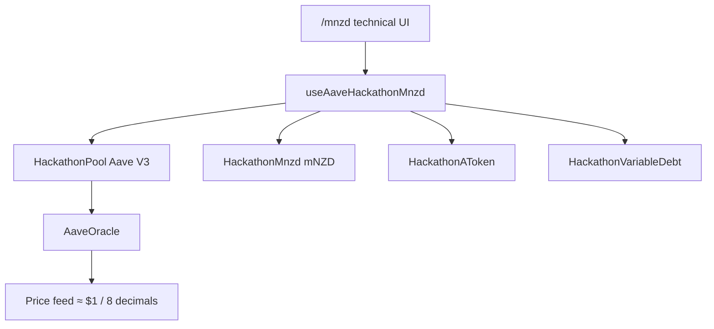

# WEB3NZ Hackathon — Build Plan (Source of Truth)

**Last reconciled with the repository + live Sepolia reads: 25 Jul 2026.**

**Team:** frontend · contracts / market deploy  
**Stack:** Scaffold-ETH 2 · Next.js / wagmi / RainbowKit · Aave V3 on Ethereum Sepolia  
**Product routes:** `/mnzd` (primary demo) · `/aave` (official Aave plumbing reference)

> **Rule:** This file is the single source of truth for what we are building *now*. If the frontend/backend seam changes, update **§6 Frontend/backend interface** here first, then tell the other person in one Discord line.

---

## 1. Project definition

### What we are building now

A **NZD-denominated savings & lending prototype** for New Zealand users, demonstrated on Ethereum Sepolia using **Aave V3**.

| Audience | Intended value |
| :--- | :--- |
| **Saver** | Put NZD-denominated test liquidity into a pool and earn supply interest. |
| **Borrower (aspirational pitch)** | Lock crypto (ETH/WETH) as collateral and borrow NZD liquidity **without selling** the crypto. |

### What the repo actually supports today

| Proposition | Status |
| :--- | :--- |
| NZD-*labelled* savings UX on a private Aave V3 market (**mNZD**) | **Supported in code** (technical UI) — mint → approve → supply → withdraw |
| Same-asset borrow (**mNZD** against supplied **mNZD**; **EURS** against **EURS**) | **Supported in code** (hooks + technical UI) — **not verified end-to-end on Sepolia in this repo** |
| **WETH/ETH collateral → borrow mNZD** | **Blocked** — hackathon market has **only one reserve (mNZD)**; no WETH listed |
| Email login / embedded wallet / gas sponsorship | **Not implemented** (RainbowKit remains) |
| Real NewMoney dNZD / NZDD / zNZD | **Not used** — asset is **mNZD** (mock stand-in, 6 decimals) |
| Official Aave mainnet listing / governance-approved NZD market | **Not claimed** — private hackathon market + separate official Sepolia EURS path |

**Honest product framing for the remainder of the hackathon:**

- **Primary product path:** private Aave V3 hackathon market with **mNZD** (`/mnzd`).
- **Reference / plumbing path:** official Aave V3 Sepolia with test **EURS** (`/aave`).
- **Do not pitch** the private mNZD market as an official Aave-listed or governance-approved market.
- **Do not claim** ETH-backed NZD borrowing until WETH (or equivalent) is listed and the flow is tested.

---

## 2. Current implementation summary

| Area | Reality |
| :--- | :--- |
| Architecture | Frontend-only integration with **two** Aave V3 markets on Sepolia. No custom `LendingPool` in this repo. |
| Hardhat package | Still stock `YourContract` only. `deployedContracts.ts` is `{}`. Product path does **not** need `yarn chain` / `yarn deploy`. |
| Wallet | **RainbowKit** (MetaMask etc.). **No Privy.** |
| Primary UI | Technical prototype panels on `/mnzd` and `/aave` via shared `AaveMarketPanel`. Not a consumer savings app. |
| Automated tests | Vitest for config + amount helpers (`yarn test:aave`). Read-only EURS smoke (`yarn aave:smoke`). **No write-tx e2e suite.** |
| Market deploy | Hackathon market was deployed **outside** this repo (aave-v3-origin `DeployHackathonMarket`); addresses committed in `hackathon-market.json`. |

---

## 3. Current architecture

```
[ RainbowKit wallet (user-funded Sepolia ETH) ]
                │
                ▼
[ Next.js app — packages/nextjs ]
   /mnzd  → useAaveHackathonMnzd  → private Aave V3 Pool (mNZD only)
   /aave  → useAaveSepolia        → official Aave V3 Sepolia Pool (EURS)
                │
                ▼
[ Aave V3 Pool ]
   approve(underlying) → supply / withdraw / borrow / repay
   getUserAccountData → HF, available borrows (USD base, 8 decimals)
                │
                ▼
[ Underlying ERC-20 ]
   mNZD (owner mint)  |  EURS (public Aave faucet)
```



**Abandoned / superseded:** custom Hardhat `LendingPool` + `MockDNZD` + `MockOracle` + stub-first Scaffold-ETH seam. See **§16**.

---

## 4. Deployed markets and assets

### 4.1 Official Aave V3 Sepolia (`/aave`)

| Item | Value |
| :--- | :--- |
| Source | `@aave-dao/aave-address-book` → `AaveV3Sepolia` |
| Pool | `0x6Ae43d3271ff6888e7Fc43Fd7321a503ff738951` |
| Demo asset | **EURS** — `0x6d906e526a4e2Ca02097BA9d0caA3c382F52278E` (**2 decimals**) |
| aToken / variable debt | From address book (`ASSETS.EURS`) |
| Other listed assets (not wired in UI) | DAI, LINK, USDC*, WBTC, **WETH**, USDT, AAVE, GHO |
| Faucet | [Aave Sepolia faucet](https://bridge-testnet.aave.com/faucet/?marketName=proto_sepolia_v3) |
| Why EURS | Public Sepolia **USDC** is supply-capped (Aave error `51`) |

\*USDC exists in the market but is unsuitable for the public demo due to supply cap.

**Official-market borrow in this app:** same-asset **EURS → EURS** only. The UI does **not** wire WETH collateral → EURS borrow (even though WETH exists on the official market).

### 4.2 Hackathon private Aave V3 market (`/mnzd`) — primary product path

| Item | Value |
| :--- | :--- |
| Market ID | `Web3NZ Hackathon mNZD Market` |
| Chain | Sepolia `11155111` |
| Pool | `0xB0ce61547bdd38139f7F764E7171Cd048323CC69` |
| Underlying | **mNZD** `0xDf40C406e03a0fA6D4bE26F96Ca3A7E6fE9baeeC` (**6 decimals**) |
| aToken | `0xA4c4E7eb3Cb6fc54CBa7b0B08549143bB7cF7DB8` |
| Variable debt | `0x0B27c6229F90ed3BA9Af911cd607198924458E6A` |
| PoolAddressesProvider | `0x2950597Bd526eB285b772f06654924bFa0b817f8` |
| AaveOracle | `0x79054dbB96Ca2d091e3B157970D8A2384e1473Ef` |
| Price feed | `0x9956e5C7994bF0d0343Cdab4025985D6B8053F44` |
| ProtocolDataProvider | `0xb5565F196F185c74370FdE81b2422d7D5d2b2bF4` |
| mNZD owner (mint) | `0x3c51093c02682e8287e4b50e9ef1a69c05cce434` *(on-chain `owner()`)* |

**On-chain verification (25 Jul 2026):**

| Check | Result |
| :--- | :--- |
| `Pool.getReservesList()` | **Exactly one reserve: mNZD** — **no WETH / ETH** |
| mNZD `symbol` / `decimals` | `mNZD` / `6` |
| Reserve config | Active; **collateral enabled**; **variable borrowing enabled**; LTV **82.50%**; liq. threshold **86.00%**; reserve factor **10%**; stable borrow off; not frozen |
| Oracle `getAssetPrice(mNZD)` | `1e8` (Aave USD base, 8 decimals ≈ **$1.00**) |
| Feed `latestAnswer` | `1e8`, 8 decimals |

**Implication:** same-asset mNZD borrow is market-configured. **WETH → mNZD borrow is impossible** until a second reserve (WETH) is listed and priced in this market.

---

## 5. Authoritative implementation status

Legend for cells: **Done** · **Partial** · **Implemented but untested** · **Technical prototype only** · **Not implemented** · **Blocked** · **Superseded** · **Optional**

| Capability | Contracts/config | Hook | Technical UI | Consumer UI | End-to-end tested | Notes |
| :--- | :--- | :--- | :--- | :--- | :--- | :--- |
| Official Aave Sepolia EURS market wiring | Done | Done | Technical prototype only | Not implemented | Partial (read-only smoke) | `/aave` · `useAaveSepolia` |
| Hackathon mNZD market wiring | Done | Done | Technical prototype only | Not implemented | Unverified writes | `/mnzd` · addresses in `hackathon-market.json` |
| Acquire test asset — EURS faucet link | Done (external) | N/A | Done (link out) | Not implemented | Unverified | Public Aave faucet |
| Acquire test asset — mNZD mint | Done (owner-only) | Done | Done (owner faucet) | Not implemented | Unverified | Not user-accessible without owner wallet |
| User-accessible mNZD faucet / open mint | Not implemented | Not implemented | Not implemented | Not implemented | — | Blocker for multi-user demo |
| Approve underlying → Pool | Done | Done | Done | Not implemented | Unverified | Exact amount; separate tx |
| Supply (EURS / mNZD) | Done | Done | Done | Not implemented | Unverified | |
| Withdraw / withdraw all | Done | Done | Done | Not implemented | Unverified | `maxUint256` for full exit |
| Same-asset borrow EURS→EURS | Done (official market) | Done | Done | Not implemented | Unverified | Variable mode `2` |
| Same-asset borrow mNZD→mNZD | Done (reserve config) | Done | Done | Not implemented | Unverified | Needs liquidity + collateral |
| Repay / repay all | Done | Done | Done | Not implemented | Unverified | Approve first when needed |
| Account health (HF, available borrows) | Done (Pool view) | Done | Done | Not implemented | Unverified | Base amounts = USD 8 decimals |
| WETH reserve on hackathon market | **Blocked** | Not implemented | Not implemented | Not implemented | — | `getReservesList` = mNZD only |
| WETH/ETH collateral → borrow mNZD | **Blocked** | Not implemented | Not implemented | Not implemented | — | Core pitch gap if retained |
| Official WETH→EURS multi-asset UI | Config exists in address book | Not implemented | Not implemented | Not implemented | — | Out of current UI scope |
| Reserve / APY / utilisation display | Not implemented | Not implemented | Not implemented | Not implemented | — | No `getReserveData` reads in UI |
| One-button Earn (approve→supply UX) | N/A | Not implemented | Not implemented | Not implemented | — | Two confirms by design today |
| Pay It Now mock “Add NZD” | Not implemented | Not implemented | Not implemented | Not implemented | — | |
| Privy email → embedded wallet | Not implemented | — | — | — | — | RainbowKit remains |
| Gas drip / sponsorship for new wallets | Not implemented | — | — | — | — | Users must faucet Sepolia ETH |
| Live dashboard / aggregates | Not implemented | Not implemented | Not implemented | Not implemented | — | |
| Event-based user counting | Partial (Pool events in ABI) | Not implemented | Not implemented | Not implemented | — | Aave `Supply`/`Borrow`/… events exist |
| Oracle price manipulation / liquidation demo | Partial (feed exists) | Not implemented | Not implemented | Not implemented | Unverified | Feed returns $1; **no confirmed setter in this repo** |
| Custom Hardhat LendingPool / MockDNZD / MockOracle | **Superseded** | — | — | — | — | Never built here |

**Reading the “End-to-end tested” column:** this repository has unit tests and a read-only EURS smoke check. There is **no committed evidence** of successful Sepolia write transactions for mint / supply / borrow / repay. Treat write flows as **implemented but untested** until a teammate confirms them live.

---

## 6. Frontend/backend interface (active seam)

Use these names and methods. Do **not** use the old custom-pool API (`LendingPool.supply(uint256)`, `getSupplyAPY`, etc.).

### 6.1 Contract names (Debug Contracts + Scaffold-ETH hooks)

| Name | Role | Market |
| :--- | :--- | :--- |
| `HackathonPool` | Aave V3 Pool | Primary (`/mnzd`) |
| `HackathonMnzd` | Underlying ERC-20 + owner `mint` | Primary |
| `HackathonAToken` | Supply receipt | Primary |
| `HackathonVariableDebt` | Variable debt token | Primary |
| `AaveV3Pool` | Official Pool | Reference (`/aave`) |
| `SepoliaEURS` | Official underlying | Reference |
| `AaveSepoliaAToken` / `AaveSepoliaVariableDebt` | Official receipts | Reference |

Registration: `packages/nextjs/contracts/externalContracts.ts`  
Configs: `packages/nextjs/config/aaveHackathonMnzd.ts` + `hackathon-market.json` · `aaveSepolia.ts`  
Hooks: `packages/nextjs/hooks/aave/useAaveHackathonMnzd.ts` · `useAaveSepolia.ts`  
Shared UI: `packages/nextjs/components/aave/AaveMarketPanel.tsx`  
Amount helpers: `packages/nextjs/utils/aave/amount.ts`

### 6.2 Writes

| Action | Call | Notes |
| :--- | :--- | :--- |
| Mint mNZD | `HackathonMnzd.mint(to, amount)` | **Owner only** |
| Approve | `underlying.approve(pool, amount)` | Exact amount (not unlimited) |
| Supply | `Pool.supply(asset, amount, onBehalfOf, 0)` | Needs allowance |
| Withdraw | `Pool.withdraw(asset, amount, to)` | Full exit: `amount = maxUint256` |
| Borrow | `Pool.borrow(asset, amount, 2, 0, onBehalfOf)` | Variable rate only |
| Repay | `Pool.repay(asset, amount, 2, onBehalfOf)` | Full: `amount = maxUint256`; approve first |

Approve and supply/repay are **never auto-chained** in current hooks.

### 6.3 Reads

| Data | Source |
| :--- | :--- |
| Wallet balance / allowance | Underlying `balanceOf` / `allowance` |
| Supplied | aToken `balanceOf` |
| Borrowed | Variable debt token `balanceOf` |
| Health / capacity | `Pool.getUserAccountData(user)` → collateral, debt, availableBorrows, LTV, healthFactor |
| Token metadata | On-chain `decimals` / `symbol` (hooks fall back to config) |

### 6.4 Units

| Quantity | Decimals / units |
| :--- | :--- |
| mNZD | **6** — `parseUnits` / `formatUnits(..., 6)` |
| EURS | **2** | 
| Health factor | 1e18 = 1.0; no debt → `maxUint256` → display `∞` |
| `availableBorrowsBase` / collateral / debt base | Aave USD base, **8 decimals** |

### 6.5 Oracle

- Hackathon: `AaveOracle.getAssetPrice(mNZD)` → `1e8` (verified).
- Feed address in JSON; `latestAnswer` ≈ $1 with 8 decimals (verified).
- Controllable price-drop for a liquidation stage stunt: **unverified** (tiny feed bytecode; no setter exposed in this frontend).

### 6.6 Refreshing hackathon addresses

1. Copy `reports/hackathon-market.json` from aave-v3-origin → `packages/nextjs/config/hackathon-market.json`
2. Restart Next.js
3. `yarn test:aave`

---

## 7. Current blockers and technical risks

### P0 blockers (if the pitch keeps ETH-backed NZD borrowing)

1. **No WETH (or other crypto) reserve on the hackathon market** — `getReservesList()` returns only mNZD. Without a second reserve + oracle source + frontend multi-asset supply/borrow, **WETH → mNZD is impossible**.
2. **mNZD mint is owner-only** — non-owner attendees cannot self-serve test NZD for a live room demo.
3. **Write flows unverified on Sepolia in-repo** — borrow/repay especially need a live confirmation before pitch claims.

### Other risks

| Risk | Detail |
| :--- | :--- |
| Same-asset borrow ≠ product pitch | Borrowing mNZD against mNZD does **not** prove “keep your ETH, borrow NZD.” |
| Liquidity | Borrow needs prior supply liquidity in the pool. |
| Gas | No drip; every wallet needs Sepolia ETH. |
| Consumer UX gap | Current UI is a debug-style panel (addresses, aToken jargon). |
| NewMoney track | Asset is **mNZD**, not NewMoney dNZD — eligibility **unverified**. |
| Oracle drama | Price feed exists at $1; stage “crash ETH” demo **not available** on this market (no ETH reserve). |

---

## 8. Remaining build priorities

### P0 — required for the core demo

Choose **one** product claim and finish it. Do not claim both.

**Option A — Retain ETH → NZD borrower pitch (harder)**

1. In aave-v3-origin: list **WETH** (or wrap ETH) on the hackathon market with oracle + LTV; refresh `hackathon-market.json`.
2. Frontend: supply WETH as collateral → show available mNZD borrow → `borrow(mNZD)` → show HF.
3. Live Sepolia verification of that full path.
4. Ensure mNZD liquidity exists (owner mint + supply from a seed wallet).

**Option B — Pivot pitch to NZD savings + same-asset credit (faster, matches repo)**

1. Live-verify on `/mnzd`: owner mint → approve → supply → borrow mNZD → repay → withdraw.
2. Seed pool liquidity so borrow does not revert.
3. Soften pitch: NZD-denominated Aave V3 market; ETH-backed loans = **roadmap**, not live demo.
4. Optional but strongly recommended for room demos: temporary open mint or pre-mint to demo wallets.

### P1 — credible consumer product

1. Consumer shell on `/mnzd` (NZD copy, hide aToken / Pool addresses by default).
2. Clear balances: wallet NZD, supplied, borrowed, health factor, “you can borrow up to …”.
3. User-accessible test NZD (open mint **or** mocked Pay It Now that calls mint via owner/relayer).
4. One-button **Earn** UX that sequences approve → supply (still two txs).
5. Show supply/borrow APY or utilisation (read Aave reserve data).

### P2 — differentiators (only after P0 works)

1. Privy email → embedded wallet.
2. Gas drip / sponsorship for new wallets.
3. Live dashboard (TVL, borrows, unique suppliers via events).
4. Liquidation / oracle drama (needs ETH collateral path **or** a controllable price on a crypto reserve).
5. Polish homepage away from stock Scaffold-ETH landing.

---

## 9. Definition of done

### Primary demo (target)

**If Option A (ETH → mNZD) is chosen and finished:**

1. Connect wallet on Sepolia (RainbowKit acceptable if Privy not done).
2. Obtain / wrap WETH; supply as collateral on hackathon Pool.
3. Borrow mNZD; show debt + health factor + available capacity.
4. Separately: saver mints/supplies mNZD so liquidity and (ideally) utilisation/APY move.
5. Repay and withdraw collateral safely.

**If Option B (matches current architecture) is chosen:**

1. Connect wallet on Sepolia.
2. Owner (or faucet) mints mNZD → user approves → supplies → sees aToken/supplied balance.
3. User borrows mNZD against supplied mNZD → debt + HF update.
4. User repays → withdraws.
5. Pitch explicitly frames ETH-backed NZD credit as **next step**, not the live demo.

### Fallback demo (honest reduced scope)

**Live click-path that must work even if borrow is flaky:**

1. Connect on Sepolia → `/mnzd`.
2. Owner mints mNZD to the demo wallet.
3. Approve → Supply → show supplied balance.
4. Withdraw (partial or all).

**Pitch limitations when using fallback only:**

- Do **not** claim ETH-backed NZD borrowing.
- Do **not** claim email onboarding / Privy.
- Do **not** claim Pay It Now or real NewMoney integration.
- Do **not** claim official Aave NZD listing.
- Do say: private Aave V3 test market, mock mNZD, savings supply/withdraw prototype.

---

## 10. Demo sequence (recommended)

### Preferred live sequence (Option B — available soonest)

1. Open `/mnzd` · connect · Sepolia.
2. Owner mint 100 mNZD (or pre-minted wallet).
3. Approve 100 → Supply 100 → show supplied + HF `∞`.
4. Borrow 40 mNZD → show debt + HF + available borrows.
5. Repay → Withdraw.
6. Optional 30s: show `/aave` as “same engine on official Aave Sepolia (EURS).”

### Stretch sequence (Option A — only if WETH listed)

1. Seed mNZD liquidity (saver wallet).
2. Borrower supplies WETH collateral.
3. Borrow mNZD without selling ETH.
4. Show HF; explain over-collateralisation.

---

## 11. Fallback scope

| Keep | Cut / demote to roadmap slide |
| :--- | :--- |
| `/mnzd` mint → supply → withdraw | Privy / email |
| Same-asset borrow if verified in time | ETH collateral borrow |
| Honest “Aave V3 private market + mNZD stand-in” | “Built on dNZD” / “official Aave market” |
| Backup screen recording of the working path | Liquidation price-drop stunt |
| | Live “users onboarded” counter |

---

## 12. Pitch and judge Q&A

### Accurate spine

1. **Problem** — NZ savers who want on-chain yield are pushed into USD markets and take FX risk they did not ask for.
2. **What we built** — a **private Aave V3 market on Sepolia** denominated in **mNZD** (mock NZD stand-in), plus a frontend that can supply, withdraw, and (when verified) same-asset borrow.
3. **What we are proving** — NZD-denominated lending UX on Ethereum using real Aave V3 mechanics — not a mainnet listing.
4. **Roadmap** — real NZD stable (e.g. NewMoney), ETH/WETH-backed NZD credit, consumer onboarding, production market.

### Say this

- “Private Aave V3 deployment on Sepolia for the hackathon — not an official Aave-listed NZD market.”
- “Settlement asset is **mNZD**, a mock stand-in — not NewMoney dNZD / NZDD.”
- “We never touch customer funds; users interact with the Pool from their wallet.”
- “Fiat onramp is mocked / not built yet; roadmap mentions Pay It Now.”

### Do not say (unless true in the live build)

- “Official Aave market for NZD”
- “Built on dNZD / NewMoney” (unless integrated)
- “Sign in with email, no seed phrase” (Privy not implemented)
- “Borrow NZD against your ETH” (blocked until WETH reserve + UI)
- “Tax-free” / “no risk” / “safe” as guarantees
- “First” / “nobody offers this” without evidence
- “X users onboarded this weekend” without real counts

### Judge Q&A (updated)

| Question | Honest answer |
| :--- | :--- |
| Is this real Aave? | “Yes — Aave V3 contracts. Official Sepolia EURS for reference; our demo market is a **private** Aave V3 deployment with mNZD. Not a governance-listed mainnet market.” |
| Where does yield come from? | “Borrowers paying interest in the pool. On testnet, rates/liquidity are demo-scale.” |
| Why not USDC? | “FX: a Kiwi earning in USD takes currency risk. We want NZD in / NZD out.” |
| Can I borrow against ETH? | **Only if Option A shipped.** Otherwise: “That’s the target credit product; this weekend’s live market is mNZD-only — ETH collateral is next.” |
| What if collateral crashes? | Explain Aave over-collateralisation + health factor. Do **not** promise a live oracle crash unless built. |
| Is minting open? | “mNZD mint is owner-controlled for the prototype.” |

### Prize angles (honest)

| Track | Angle | Caveat |
| :--- | :--- | :--- |
| Fire Eyes / Ethereum | Working Aave V3 prototype on Sepolia | Private market ≠ official listing |
| CNZ / NZ needs | NZD credit / savings narrative | Live demo may be savings-first |
| NewMoney | Roadmap to their stable | **Currently mNZD stand-in — confirm eligibility** |
| Content | Film whatever flow actually works | Do not film claims the app cannot do |

---

## 13. Roles and ownership

| Owner | Own this | Do not derail into |
| :--- | :--- | :--- |
| **Contracts / market** | aave-v3-origin market config; WETH listing if Option A; seed liquidity; confirm mint owner key; oracle/feed admin if needed | Rewriting a custom LendingPool in Hardhat |
| **Frontend** | `/mnzd` consumer shell; faucet UX; Earn sequencing; borrow clarity; backup video | Premature Privy before P0 path works |
| **Both** | Agree Option A vs B today; run live Sepolia write-path once; freeze pitch claims to match | Expanding scope after freeze |

---

## 14. Setup and testing instructions

```bash
yarn install
# packages/nextjs/.env.local:
#   ALCHEMY_API_KEY=...
#   NEXT_PUBLIC_WALLET_CONNECT_PROJECT_ID=...
yarn start
# open http://localhost:3000/mnzd  (primary)
#      http://localhost:3000/aave  (official EURS reference)
```

Checks:

```bash
yarn test:aave
yarn next:check-types
yarn aave:smoke          # read-only official EURS addresses; needs ALCHEMY_API_KEY
```

Manual Sepolia checklist (do this before pitching):

- [ ] Owner can mint mNZD on `/mnzd`
- [ ] Approve + supply updates aToken balance
- [ ] Withdraw returns mNZD
- [ ] Same-asset borrow updates variable debt + HF
- [ ] Repay clears debt
- [ ] (Option A only) WETH supply → mNZD borrow

**Not required for product path:** `yarn chain`, `yarn deploy` (Hardhat `YourContract` only).

---

## 15. Deployed addresses and key files

### Hackathon mNZD (from `packages/nextjs/config/hackathon-market.json`)

```
NETWORK:                 Sepolia (11155111)
Market ID:               Web3NZ Hackathon mNZD Market
HackathonPool:           0xB0ce61547bdd38139f7F764E7171Cd048323CC69
mNZD:                    0xDf40C406e03a0fA6D4bE26F96Ca3A7E6fE9baeeC   (6 decimals)
HackathonAToken:         0xA4c4E7eb3Cb6fc54CBa7b0B08549143bB7cF7DB8
variableDebtToken:       0x0B27c6229F90ed3BA9Af911cd607198924458E6A
PoolAddressesProvider:   0x2950597Bd526eB285b772f06654924bFa0b817f8
AaveOracle:              0x79054dbB96Ca2d091e3B157970D8A2384e1473Ef
Price feed:              0x9956e5C7994bF0d0343Cdab4025985D6B8053F44
ProtocolDataProvider:    0xb5565F196F185c74370FdE81b2422d7D5d2b2bF4
mNZD owner:              0x3c51093c02682e8287e4b50e9ef1a69c05cce434
```

### Official EURS (from address book — do not hardcode in components)

See `packages/nextjs/config/aaveSepolia.ts` / `AaveV3Sepolia`.

### Key files

| Concern | Path |
| :--- | :--- |
| This plan | `docs/BUILD_PLAN.md` |
| Official Aave docs | `docs/AAVE_SEPOLIA.md` |
| Hackathon mNZD docs | `docs/AAVE_HACKATHON_MNZD.md` |
| Web2 handoff | `docs/WEB2_HANDOFF.md` *(may lag borrow UI — prefer this plan + AAVE_*.md)* |
| Pages | `packages/nextjs/app/mnzd/page.tsx`, `app/aave/page.tsx` |
| Hooks | `packages/nextjs/hooks/aave/*` |
| External contracts | `packages/nextjs/contracts/externalContracts.ts` |
| ABIs | `packages/nextjs/contracts/abis/aaveSepolia.ts` |
| Target network | `packages/nextjs/scaffold.config.ts` (Sepolia) |

---

## 16. Original plan — superseded

The weekend originally planned:

- Custom ~150-line Hardhat `LendingPool` + `MockDNZD` + `MockOracle`
- Stub-first interface (`getSupplyAPY`, `depositCollateral` payable ETH, etc.)
- Privy email onboarding + gas drip in hour one
- Demo money shot: ETH collateral → borrow dNZD → utilisation/APY jump → oracle price drop

**What happened instead:** the team integrated **real Aave V3** (official Sepolia EURS + a private hackathon mNZD market from aave-v3-origin). The custom pool was never implemented in this repository and should not be restarted unless the Aave path is abandoned.

Useful ideas retained from the original plan (as product intent, not as active API):

- NZD-denominated savings UX for non-crypto natives
- Borrow against crypto **without selling** (still the sharpest story — currently blocked on hackathon market)
- Mock fiat onramp labelled Pay It Now
- Live-user proof and projector dashboard

Obsolete seam (`LendingPool` / `MockDNZD` / `MockOracle` function tables) is intentionally **not** reproduced here so it cannot be mistaken for the active interface.

---

*When reality changes the seam or the demo claim, edit this file first, then one Discord line to the other person.*
