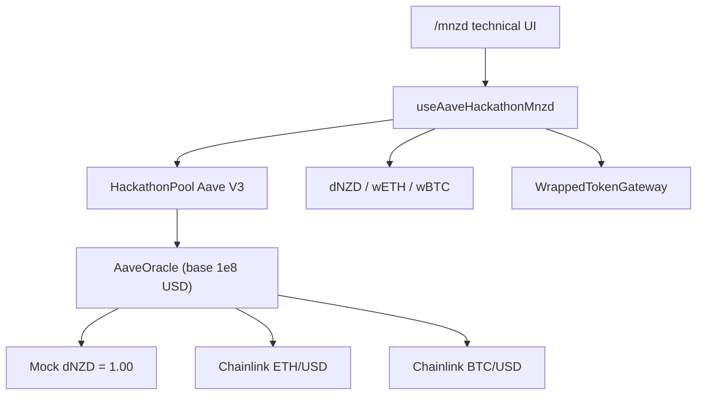

# WEB3NZ Hackathon — Build Plan

**Last updated: 25 Jul 2026.**

> **Live market addresses and on-chain status:** treat [HANDOVER.md](./HANDOVER.md) as authoritative.
> This file keeps product framing, pitch honesty rules, and the frontend/backend seam.
> An earlier revision described a **superseded** market (`mNZD`, pool `0xB0ce…CC69`, mock crypto oracles).
> That content is summarised in [§17](#17-appendix--superseded-market-do-not-use).

**Team:** frontend · contracts / market deploy  
**Stack:** Scaffold-ETH 2 · Next.js / wagmi / RainbowKit · Aave V3 on Ethereum Sepolia  
**Product routes:** `/mnzd` (primary: wETH / wBTC / **dNZD**) · `/aave` (official EURS — **hidden from nav**)

### Evidence conventions

| Tag | Meaning |
| :--- | :--- |
| **[Verified]** | Read from Sepolia or committed source (this repo / `aave-v3-origin`). |
| **[Derived]** | Follows deterministically from a **[Verified]** fact. |
| **[Unverified]** | Plausible but not confirmed. Do not pitch as fact. |
| **[Recommendation]** | Proposed action, not current reality. |

---

## 1. Project definition

### What we are building

A **NZD-denominated savings & lending prototype** for New Zealand users, demonstrated on Ethereum Sepolia using **Aave V3**.

| Audience | Intended value |
| :--- | :--- |
| **Saver** | Supply NZD-denominated test liquidity and earn interest **when borrowing demand exists**. |
| **Borrower** | Lock crypto (ETH/wETH) as collateral and borrow NZD liquidity **without selling** the crypto. |

### What the repo and the deployed market support today

| Proposition | Status |
| :--- | :--- |
| NZD-*labelled* UX on a private Aave V3 market (**dNZD**) | **Done** — UI + wiring; same-asset flows proven on an earlier market; **current pool unproven for borrow** until dNZD is seeded ([HANDOVER §4.1](./HANDOVER.md#41-the-dnzd-reserve-has-zero-liquidity--nothing-can-be-borrowed)) |
| Same-asset borrow (dNZD against dNZD) | Protocol validation only — not a consumer product (§3) |
| Same-asset borrow (EURS against EURS, official market) | Implemented; read-only smoke only |
| **wETH / wBTC reserves** | **Done** — listed, active, collateral + borrow enabled; admin has supplied crypto collateral **[Verified]** |
| **wETH/ETH collateral → borrow dNZD** | **Blocked on dNZD pool liquidity = 0**; UI and market config ready; also blocked for *pitch numbers* by dNZD USD mispricing (§2) |
| Email login / embedded wallet | **Implemented** via Privy when `NEXT_PUBLIC_PRIVY_APP_ID` is set (email + wallet + socials → embedded wallet + iron-session). RainbowKit fallback without Privy env. Gas sponsorship still **not implemented** |
| Real NewMoney dNZD / NZDD / zNZD | **Not used** — asset is **dNZD** (demo stand-in, 6 decimals, owner-mintable) |
| Official Aave mainnet listing | **Not claimed** |

**Honest framing:**

- **Primary path:** private Aave V3 hackathon market with **wETH, wBTC, dNZD** (`/mnzd`).
- **Reference path:** official Aave V3 Sepolia **EURS** (`/aave`) — hidden from nav.
- Do **not** pitch the private market as governance-listed.
- Oracles: **wETH / wBTC = live Chainlink Sepolia**; **dNZD = $1 mock** (still USD-referenced — §2).

---

## 2. Oracle reference currency

Highest-priority pricing defect that remains after the market redeploy.

### 2.1 What is live now

| Property | Value | Source |
| :--- | :--- | :--- |
| `AaveOracle` | `0x809779d09cB0B9F85D191761Ef4a0a0076eED429` | `hackathon-market.json` / HANDOVER |
| Base unit | `1e8` (8 decimals), `BASE_CURRENCY = address(0)` | Aave USD convention |
| `getAssetPrice(dNZD)` | `1.00` — **mock**, constant | HANDOVER §2 |
| `getAssetPrice(wETH)` | Live Chainlink Sepolia **ETH/USD** (`0x694AA176…25306`) | HANDOVER §2 |
| `getAssetPrice(wBTC)` | Live Chainlink Sepolia **BTC/USD** (`0x1b44F351…51Ee43`) | HANDOVER §2 |

Crypto feeds move on their own. Demo scripts must not assume fixed ETH/BTC prices.

### 2.2 Model in force: USD reference, dNZD mispriced as US$1

- Verified reference currency: **USD** (Chainlink ETH/USD and BTC/USD).
- dNZD is priced at `1e8` = **US$1.00**, but is meant to represent **NZ$1**.
- Correct dNZD price under this model ≈ **NZD/USD × 1e8 ≈ `0.60e8`**.

Same-asset dNZD → dNZD is unaffected (price cancels). Cross-asset borrow capacity against crypto is **understated by ~40%**.

UI label in `AaveMarketPanel.tsx`: **"Available to borrow (USD base)"** — accurate for the reference currency, awkward for an NZD product.

### 2.3 Remediation (needs admin key + sibling repo)

Both options: `AaveOracle.setAssetSources` from Pool Admin (see HANDOVER §4.2).

| | **Fix 1 — stay in USD** | **Fix 2 — redenominate to NZD (recommended)** |
| :--- | :--- | :--- |
| Action | New mock feed for dNZD ≈ `0.60e8` | Wrap/adapt Chainlink feeds ÷ NZD/USD (or NZD-priced mocks) |
| UI label | Keep "USD base" | Change to "NZD base" |
| Narrative | NZD product reporting in USD | Full account view in NZD |

---

## 3. Same-asset borrowing — what it is and is not

Supplying dNZD and borrowing dNZD is **not** a consumer credit product. Do not pitch it as one.

It is:

1. A protocol integration test (decimals, interest mode `2`, `maxUint256` repay).
2. Proof that debt accounting and health factor work.
3. A temporary technical demonstration — never the headline.

**Positioning:** ETH/wETH-backed NZD borrowing is the intended credit product.

---

## 4. Deployed markets and assets

### 4.1 Official Aave V3 Sepolia (`/aave`)

| Item | Value |
| :--- | :--- |
| Source | `@aave-dao/aave-address-book` → `AaveV3Sepolia` |
| Demo asset | **EURS** (**2 decimals**) |
| Faucet | [Aave Sepolia faucet](https://bridge-testnet.aave.com/faucet/?marketName=proto_sepolia_v3) |
| Why EURS | Public Sepolia USDC is supply-capped (error `51`) |

Official-market borrow in this app: same-asset **EURS → EURS** only. Details: [AAVE_SEPOLIA.md](./AAVE_SEPOLIA.md).

### 4.2 Hackathon private market (`/mnzd`) — primary

**Source of truth for addresses:** [`packages/nextjs/config/hackathon-market.json`](../packages/nextjs/config/hackathon-market.json).

| Item | Value |
| :--- | :--- |
| Market ID | `Web3NZ Hackathon dNZD Market` |
| Chain | Sepolia `11155111` |
| Pool | `0xe1556e1f65Aa99682e96Ad3de866f446D2A1275e` |
| PoolAddressesProvider | `0x4e8a83e4061a9A3EC26f575f918C1CDb8775291b` |
| AaveOracle | `0x809779d09cB0B9F85D191761Ef4a0a0076eED429` |
| ProtocolDataProvider | `0x59d373bfc3E4c7c0813eE81566Fcf91C37f55D35` |
| ACLManager | `0xaed9938445b4fa4E9cA72b96C7B977d08298a971` |
| ConfigEngine | `0x4B6911A24aD240986fc5fEC09D1bbb3a18F1cCE2` |
| WrappedTokenGateway | `0x2Ac0b0B36CD831d71D315AF868429C312d1C5B52` |
| Owner / ACL admin / token owner | `0x1bE00A54aF36eDF41f169258eCF27574EB61F10f` |

### 4.3 Reserves (config; live balances in HANDOVER §2)

All three: LTV **82.5%** · LT **86%** · liq. bonus **5%** · RF **10%** · uncapped · active.

| | **dNZD** | **wETH** | **wBTC** |
| :--- | :--- | :--- | :--- |
| Underlying | `0x9c6ed608C36D8a483377867b61452765A669416F` | `0xA9e6db07425b1Abba96F43C7923988f100d2B508` | `0x82Ae40412Cc3C46309413155b4dc903d06494a12` |
| aToken | `0x1A6468598646f4f17F3E84ffEaD2F292830A7335` | `0xF27D136E94e07f1C52067f717B9F07202aE8c6C4` | `0x10C665257aFfecee397A86d3DB0569be256e5843` |
| Variable debt | `0xC805Fbac842BAdB6992B89B3249898d833b6858d` | `0xC73dA70cDB2B6916f92EDC2aCF52A093972D47a6` | `0xb340f057F2AB01Fa74980207D734b850A0BC45E4` |
| Price feed | Mock $1 | Chainlink ETH/USD | Chainlink BTC/USD |
| Decimals | 6 | 18 | 8 |
| Acquisition | owner `mint` | wrap via **this market's WETH9** | owner `mint` |

**This market's WETH9 is not canonical Sepolia WETH.** ETH wrapped elsewhere is useless here.

### 4.4 Liquidity snapshot (reconcile via HANDOVER / `yarn risk:smoke`)

At last HANDOVER read: **0 dNZD** in the pool; **1 wETH + 100 wBTC** supplied by admin; **zero** total debt. Until dNZD is supplied, every `borrow(dNZD, …)` reverts.

---

## 5. Current implementation summary

| Area | Reality |
| :--- | :--- |
| Architecture | Frontend + public API over two Aave V3 markets. No custom `LendingPool` in this repo. |
| Hardhat | Stock `YourContract` only. `deployedContracts.ts` is `{}`. |
| Wallet / auth | Privy (email, wallet, socials + embedded wallets + `/api/auth/session`) when configured; else RainbowKit. |
| Primary UI | Technical panels on `/mnzd` via `AaveMarketPanel` + `BorrowRiskAssistant`. |
| Risk / API | Deterministic stress engine + `/api/v1` (see [API.md](./API.md)). |
| Tests | `yarn test:aave`; `yarn risk:smoke`; opt-in `yarn aave:e2e`. |
| Market deploy | Outside this repo (`aave-v3-origin`). |



---

## 6. Authoritative implementation status

| Capability | Status | Notes |
| :--- | :--- | :--- |
| Official EURS wiring (`/aave`) | Done (tech UI) | Hidden from nav |
| Hackathon market wiring (3 reserves) | Done (tech UI) | `/mnzd` · `hackathon-market.json` |
| dNZD / wBTC owner mint | Done | Owner-only — no public faucet |
| Approve / supply / withdraw / borrow / repay | Done in hooks + UI | Variable mode `2` |
| Wrap ETH / gateway `depositETH` | Done | Market's own WETH9 |
| Account health (HF, available borrows) | Done | Label says "USD base" |
| wETH/wBTC collateral → borrow dNZD | **Blocked** | Needs dNZD liquidity seed; pitch numbers need §2 fix |
| NZD-referenced oracle pricing | **Not implemented** | §2.3 |
| Reserve APY / utilisation UI | Not implemented | No `getReserveData` in UI |
| One-button Earn (approve→supply UX) | Not implemented | Two confirms by design |
| Privy auth / embedded wallets | Done (env-gated) | Gas sponsorship still open |
| Gas sponsorship | Not implemented | |
| Indexer / dashboard | Not implemented | Events exist on Pool |
| Borrow Risk Assistant + public API | Done | Most product-ready surface |
| Custom Hardhat LendingPool | **Superseded** | Never built here |

---

## 7. Frontend/backend interface (active seam)

Do **not** use any old custom-pool API (`LendingPool.supply`, `getSupplyAPY`, etc.).

### 7.1 Contract names

| Name | Role | Market |
| :--- | :--- | :--- |
| `HackathonPool` | Aave V3 Pool | Primary (`/mnzd`) |
| `HackathonMnzd` / `HackathonWeth` / `HackathonWbtc` | Underlyings | Primary |
| `HackathonATokenMnzd` / `…Weth` / `…Wbtc` | Supply receipts | Primary |
| `HackathonDebtMnzd` / `…Weth` / `…Wbtc` | Variable debt | Primary |
| `HackathonWrappedTokenGateway` | Wrap + supply ETH | Primary |
| `AaveV3Pool` / `SepoliaEURS` / … | Official market | Reference (`/aave`) |

Registration: `packages/nextjs/contracts/externalContracts.ts`  
Configs: `aaveHackathonMnzd.ts` + `hackathon-market.json` · `aaveSepolia.ts`  
Hooks: `useAaveHackathonMnzd.ts` · `useAaveSepolia.ts`  
Shared UI: `AaveMarketPanel.tsx` · `BorrowRiskAssistant.tsx`

### 7.2 Writes

| Action | Call |
| :--- | :--- |
| Mint dNZD / wBTC | `mint(to, amount)` — **owner only** |
| Wrap ETH | `HackathonWeth.deposit()` payable |
| Approve | `underlying.approve(pool, amount)` |
| Supply | `Pool.supply(asset, amount, onBehalfOf, 0)` |
| Supply ETH | `Gateway.depositETH(pool, onBehalfOf, 0)` payable |
| Withdraw | `Pool.withdraw` — full exit `maxUint256` |
| Borrow | `Pool.borrow(..., 2, 0, onBehalfOf)` — variable only |
| Repay | `Pool.repay(..., 2, onBehalfOf)` — full `maxUint256` |

Approve and supply/repay are **never auto-chained** (except gateway `depositETH`).

### 7.3 Units

| Quantity | Decimals / units |
| :--- | :--- |
| dNZD | **6** |
| wETH | 18 |
| wBTC | **8** |
| EURS | **2** |
| Health factor | 1e18 = 1.0; no debt → `maxUint256` → `∞` |
| Base amounts | **8 decimals**, currently **USD** |

### 7.4 Refreshing addresses

1. Copy `reports/hackathon-market.json` from `aave-v3-origin` → `packages/nextjs/config/hackathon-market.json`
2. Restart Next.js
3. `yarn test:aave` and `cd packages/nextjs && yarn risk:smoke`
4. Update [HANDOVER.md](./HANDOVER.md) §2

---

## 8. Four things people conflate

| Concept | Status |
| :--- | :--- |
| 1. Wrapping ETH into this market's WETH9 | UI exists; admin has wrapped/supplied |
| 2. Listing wETH as a reserve | **Done** |
| 3. Enabling wETH as collateral | **Done** (LTV 82.5% / LT 86%) |
| 4. Borrowing dNZD against wETH | **Not yet on this pool** — needs dNZD liquidity |

Wrapping ETH ≠ listing wETH.

---

## 9. Remaining build priorities

### P0 — unblock the product story

1. Seed dNZD liquidity from admin (`0x1bE00A54…F10f`) — HANDOVER §4.1.
2. Run wrap → supply wETH → borrow dNZD → repay → withdraw once; record hashes.
3. Decide oracle denomination (§2.3); fix UI base label to match.
4. Demo from a wallet with realistic collateral (admin's 100 wBTC looks like test data).
5. Keep this file and HANDOVER aligned when addresses change.

### P1 — consumer product

1. NZD consumer shell on `/mnzd` (hide raw aToken / addresses).
2. User-accessible test NZD (open faucet or relayer — custody caveats §13).
3. One-button Earn (sequence approve → supply).
4. Show supply/borrow APY / utilisation (`getReserveData`).
5. Replace stock home page.

### P2 — differentiators

1. Gas sponsorship on Privy embedded wallets.
2. Ponder (or subgraph) indexer + dashboard.
3. Position monitoring / HF alerts (extend risk engine).
4. Liquidation demo (harder with live Chainlink — no free mock setter on crypto).

---

## 10. Verified transactions

**Current market (`0xe1556e1f…275e`):** no borrow-side hashes recorded yet. Use HANDOVER §2 for live balances; fill this table when the end-to-end path is executed.

| Flow | Status |
| :--- | :--- |
| Seed supply dNZD | ❌ Pending |
| Wrap ETH → supply wETH | Partial (admin has 1 wETH supplied) |
| wETH → borrow dNZD | ❌ Blocked on liquidity |
| Same-asset dNZD borrow on **this** pool | ❌ Not yet |

Historical hashes against the **old** pool `0xB0ce…CC69` / `mNZD` are in [§17](#17-appendix--superseded-market-do-not-use). Do not cite them as evidence for the current market.

---

## 11. Go/no-go — Option A vs Option B

> Fill in deadline / owner when pitching.

### Option A — wETH-backed dNZD borrowing

Ship only if: dNZD seeded, at least one successful borrow hash, and pitch numbers match the chosen oracle model.

### Option B — savings / protocol-validation demo

Show mint → supply → withdraw; same-asset borrow only as a technical aside; ETH-backed borrow on the roadmap.

---

## 12. Definition of done and demo sequence

### If Option A is live

1. Lender supplies dNZD.
2. Borrower wraps/supplies wETH (or gateway Supply ETH).
3. UI shows borrow capacity (after §2 fix: in NZD).
4. Borrow dNZD without selling ETH → show HF → repay → withdraw.

### Fallback

1. `/mnzd` on Sepolia → obtain dNZD (owner mint) → approve → supply → withdraw.
2. Optional: same-asset borrow as protocol validation only.
3. Optional: `/aave` as "same engine, official market."

### Pitch limitations (fallback)

- Do not claim ETH-backed NZD borrowing is live without a hash.
- Do not claim email onboarding, Pay It Now, NewMoney, or official Aave NZD listing.
- Do say: private Aave V3 test market, mock dNZD, verifiable Sepolia txs.

---

## 13. Pitch and judge Q&A

### Accurate spine

1. **Problem** — NZ savers pushed into USD markets take unwanted FX risk.
2. **What we built** — private Aave V3 market on Sepolia with **dNZD** + frontend + risk API.
3. **What we prove** — NZD-denominated lending UX on real Aave V3. Not a mainnet listing.
4. **Roadmap** — real NZD stable, consumer onboarding, production market.

### Say this

- "Private Aave V3 deployment on Sepolia — not an official Aave-listed NZD market."
- "Settlement asset is **dNZD**, a demo stand-in — not NewMoney production issuance."
- "The product is non-custodial: users transact directly with the Aave Pool from their own wallets."
- "wETH/wBTC prices come from Chainlink Sepolia; dNZD is still a $1 mock."

### Custody — precise wording

Non-custodial for **user positions**. Caveats: owner-only mint, any future relayer faucet, Privy embedded wallets, gas sponsorship. Do not say "we never touch customer funds" if those land.

### Yield — precise wording

> "Supply NZD-denominated test liquidity and earn interest when borrowing demand exists."

Supplier interest comes from borrowers (minus 10% reserve factor). No borrow demand → negligible yield.

### Do not say (unless true)

- Official Aave market for NZD / built on production NewMoney
- Sign in with email / Privy
- Borrow NZD against ETH — **only with a verified hash**
- Same-asset borrow as the credit product
- Guaranteed yield / tax-free / risk-free

### Judge Q&A (short)

| Question | Honest answer |
| :--- | :--- |
| Is this real Aave? | Real Aave V3 contracts; private market + official EURS reference. Not governance-listed for NZD. |
| Where does yield come from? | Borrowers' interest, minus reserve factor. |
| Why not USDC? | FX: NZD in / NZD out. |
| Can I borrow against ETH? | Only if Option A shipped with a hash; otherwise roadmap. Market + UI support it; liquidity/oracle caveats apply. |
| Why is dNZD $1? | Mock feed is USD-referenced; meant to be NZ$1. Same-asset flows unaffected. Fix is `setAssetSources`. |

---

## 14. Roles

| Owner | Own this |
| :--- | :--- |
| **Contracts / market** | Seed dNZD; oracle fix; custody of `0x1bE00A54…F10f`; prove wETH→dNZD once |
| **Frontend** | Base-currency label; consumer shell; faucet UX; Earn sequencing |
| **Both** | Keep HANDOVER + this plan aligned; freeze pitch claims to match evidence |

---

## 15. Setup and testing

```bash
yarn install
# packages/nextjs/.env.local — ALCHEMY_API_KEY, NEXT_PUBLIC_WALLET_CONNECT_PROJECT_ID
yarn start
# http://localhost:3000/mnzd
```

```bash
yarn test:aave
yarn next:check-types
yarn aave:smoke
cd packages/nextjs && yarn risk:smoke
```

**Not required for the product path:** `yarn chain`, `yarn deploy`.

---

## 16. Key files

| Concern | Path |
| :--- | :--- |
| Live state / blockers | `docs/HANDOVER.md` |
| This plan | `docs/BUILD_PLAN.md` |
| Hackathon runbook | `docs/AAVE_HACKATHON_MNZD.md` |
| Official EURS | `docs/AAVE_SEPOLIA.md` |
| Risk + API | `docs/BORROW_RISK_ASSISTANT.md`, `docs/API.md` |
| Web2 handoff | `docs/WEB2_HANDOFF.md` |
| Address SoT | `packages/nextjs/config/hackathon-market.json` |
| Market deploy | `aave-v3-origin` scripts `DeployHackathonMarket` / `ListHackathonWethWbtc` |

---

## 17. Appendix — superseded market (do not use)

A prior private market used asset name **mNZD**, pool `0xB0ce61547bdd38139f7F764E7171Cd048323CC69`, admin `0x3C51093c…e434`, and **mock** aggregators for ETH ($1,800) and BTC ($27,000). Same-asset mNZD flows were verified with Sepolia tx hashes on that pool.

That market was replaced (frontend pointed at the new deployment in commit `02bbbc7`). **Do not index, demo, or cite that pool as current.**

Also superseded: the original weekend idea of a custom Hardhat `LendingPool` + `MockDNZD` + `MockOracle` — never implemented here; real Aave V3 was integrated instead.

---

*When the seam or demo claim changes, update [HANDOVER.md](./HANDOVER.md) for live state first, then this file for product/pitch framing.*
